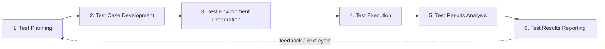

# BGSTM - Better Global Software Testing Methodology

[](https://github.com/bg-playground/BGSTM/actions/workflows/ci.yml)
[](https://github.com/bg-playground/BGSTM/actions/workflows/frontend-ci.yml)
[](https://github.com/bg-playground/BGSTM/actions/workflows/docker.yml)
[](https://github.com/bg-playground/BGSTM/actions/workflows/e2e-tests.yml)

**BGSTM** is a practical, methodology-agnostic software testing framework for organizing quality work from planning through results reporting. It is designed to work across Agile, Scrum, Waterfall, and hybrid delivery models without forcing teams into a single development process.

> **Canonical methodology:** BGSTM has exactly **six core testing phases**. Specialized domains such as ETL semantic validation apply those six phases; they do not add new phases.

## Start here

If you are evaluating BGSTM for the first time:

1. Read the **[Getting Started Guide](docs/GETTING-STARTED.md)** for a practical introduction.
2. Review the **[six testing phases](docs/phases/index.md)** to understand the lifecycle.
3. Choose a **[methodology guide](docs/methodologies/comparison.md)** for Agile, Scrum, Waterfall, or hybrid delivery.
4. Adapt the **[canonical test templates](docs/test-templates/README.md)** to your project.
5. Use the **[worked examples](docs/examples/README.md)** to see the framework applied in practice.

## The six BGSTM phases



| Phase | Purpose |
|---|---|
| **1. [Test Planning](docs/phases/01-test-planning.md)** | Define scope, strategy, risks, resources, and timelines. |
| **2. [Test Case Development](docs/phases/02-test-case-development.md)** | Design traceable test scenarios and cases. |
| **3. [Test Environment Preparation](docs/phases/03-test-environment-preparation.md)** | Prepare infrastructure, tools, access, and test data. |
| **4. [Test Execution](docs/phases/04-test-execution.md)** | Execute tests, collect evidence, and manage defects. |
| **5. [Test Results Analysis](docs/phases/05-test-results-analysis.md)** | Interpret outcomes, trends, risks, and quality signals. |
| **6. [Test Results Reporting](docs/phases/06-test-results-reporting.md)** | Communicate findings and support release decisions. |

## What is in this repository?

BGSTM is first and foremost a **testing methodology and knowledge base**. This repository also includes an open-source reference application that demonstrates how parts of the methodology can be represented in software.

| Area | Purpose | Start here |
|---|---|---|
| **Methodology** | The six-phase BGSTM lifecycle and testing guidance | [Testing phases](docs/phases/index.md) |
| **Methodology adaptations** | Agile, Scrum, Waterfall, and comparison guidance | [Methodology guides](docs/methodologies/comparison.md) |
| **Templates** | Reusable test plans, cases, reports, risk and traceability artifacts | [Test templates](docs/test-templates/README.md) |
| **Worked examples** | Practical applications of BGSTM, including ETL semantic validation | [Examples](docs/examples/README.md) |
| **Reference application** | FastAPI + React implementation for traceability, dashboards, reporting, and related workflows | [Application setup](#reference-application-quick-start) |
| **Automation integration** | Playwright and external-result integration patterns | [External Results v1](docs/specs/external_results_v1.md) |

### Applied example: ETL semantic validation

**[ETL Semantic Validation](docs/examples/etl-semantic-validation-example.md)** is a specialized example showing how all six BGSTM phases can be applied to ETL/data-pipeline semantic validation using NATAegisFlow evidence. It is **not** an additional methodology phase.

## Core principles

- **Methodology agnostic** — adapt BGSTM to Agile, Scrum, Waterfall, or hybrid delivery.
- **End-to-end quality lifecycle** — connect planning, design, environment readiness, execution, analysis, and reporting.
- **Traceability** — maintain meaningful links between requirements, tests, results, defects, evidence, and decisions.
- **Risk-aware testing** — scale rigor and effort according to business and technical risk.
- **Evidence-based reporting** — use test outcomes and quality signals to support stakeholder decisions.
- **Practical adoption** — start with the methodology and templates; use software tooling where it adds value.

## Documentation map

- **[Complete documentation](docs/README.md)**
- **[Getting Started](docs/GETTING-STARTED.md)**
- **[Testing phases](docs/phases/index.md)**
- **[Methodology comparison](docs/methodologies/comparison.md)**
- **[Test templates](docs/test-templates/README.md)**
- **[Examples](docs/examples/README.md)**
- **[Multi-platform application guide](docs/integration/multi-platform-guide.md)**
- **[Release Readiness Dashboard](docs/features/release-readiness-dashboard.md)**
- **[Quality KPI Dashboard](docs/features/quality-kpi-dashboard.md)**

## Reference application quick start

The repository includes a reference application with a React frontend, FastAPI backend, PostgreSQL database, traceability features, quality dashboards, and automated test coverage.

```bash
git clone https://github.com/bg-playground/BGSTM.git
cd BGSTM
./setup.sh        # macOS/Linux
setup.bat         # Windows
```

The setup script checks Docker/Docker Compose, creates `.env` from `.env.example`, starts the services, waits for health checks, and can load sample data.

| Service | URL |
|---|---|
| Frontend | http://localhost |
| Backend API | http://localhost:8000 |
| API Docs | http://localhost:8000/docs |

```bash
docker compose down
docker compose logs -f
```

For development details, see the [backend README](backend/README.md), the frontend source under [`frontend/`](frontend/), and the [E2E test guide](frontend/tests/e2e/README.md).

## Testing and CI

The repository uses automated checks for backend, frontend, Docker, end-to-end behavior, security, and documentation link integrity. Common local checks include:

```bash
# Backend
cd backend
pytest
ruff check .
ruff format --check .
mypy .
```

```bash
# Frontend
cd frontend
npm install
npm run lint
npm run type-check
```

The Playwright suite covers authentication, CRUD, suggestions, traceability, exports, RBAC, notifications, release readiness, and quality dashboards. See the **[E2E Test README](frontend/tests/e2e/README.md)** for setup and execution details.

Documentation changes are checked for broken internal Markdown links by the **Documentation Links** workflow.

## API contracts and automation integration

| Spec | Status | Tracking |
|---|---|---|
| [External Results v1](docs/specs/external_results_v1.md) | Draft | [BGSTM#299](https://github.com/bg-playground/BGSTM/issues/299) |

### Related Playwright project

**[bg-playground/bgstm-playwright-frameworks](https://github.com/bg-playground/bgstm-playwright-frameworks)** provides opinionated Playwright automation scaffolding with BGSTM-native traceability.

The intended relationship is:

```text
BGSTM                         methodology + traceability/reference platform
   ▲
   │ reports test results
   │
bgstm-playwright-frameworks  Playwright execution scaffolding
   ▲
   │ may run at scale on
   │
NAT                           managed execution + AI-adaptive testing
```

This separation keeps BGSTM's methodology independent from any single automation framework or commercial execution platform.

## Contributing

Contributions are welcome for documentation, examples, templates, methodology improvements, application code, and integrations. Please review **[CONTRIBUTING.md](CONTRIBUTING.md)** before opening a pull request.

Two documentation rules are especially important:

- BGSTM's canonical methodology contains **six phases**.
- `docs/test-templates/` is the canonical template directory; `docs/templates/` exists only for legacy-link compatibility.

## License

This project is licensed under the MIT License. See **[LICENSE](LICENSE)**.

## Related resources

- [ISTQB — International Software Testing Qualifications Board](https://www.istqb.org/)
- [Agile Testing](https://agiletester.ca/)
- [Martin Fowler — The Practical Test Pyramid](https://martinfowler.com/articles/practical-test-pyramid.html)
- [Playwright](https://playwright.dev/)

## Support

For questions, suggestions, defects, or documentation improvements, please open an issue in this repository.
