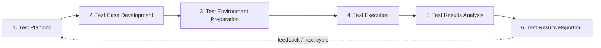

<p align="center">
  
</p>

<h1 align="center">BGSTM - Better Global Software Testing Methodology</h1>

<p align="center">
  <strong>A practical six-phase software testing methodology for Agile, Scrum, Waterfall, and hybrid delivery.</strong>
</p>

<p align="center">
  <a href="https://bg-playground.github.io/BGSTM/"><strong>Read the Documentation</strong></a>
  ·
  <a href="https://bg-playground.github.io/BGSTM/getting-started/">Getting Started</a>
  ·
  <a href="https://bg-playground.github.io/BGSTM/minimum-viable-adoption/">Minimum Viable Adoption</a>
  ·
  <a href="https://github.com/bg-playground/BGSTM/releases/tag/v2.1.0">v2.1.0 Release</a>
</p>

<p align="center">
  <a href="https://github.com/bg-playground/BGSTM/actions/workflows/ci.yml"></a>
  <a href="https://github.com/bg-playground/BGSTM/actions/workflows/frontend-ci.yml"></a>
  <a href="https://github.com/bg-playground/BGSTM/actions/workflows/e2e-tests.yml"></a>
  <a href="https://github.com/bg-playground/BGSTM/actions/workflows/docker.yml"></a>
  <a href="https://github.com/bg-playground/BGSTM/releases/tag/v2.1.0"></a>
  <a href="LICENSE"></a>
</p>

---

## What is BGSTM?

**BGSTM** is a methodology-agnostic framework for organizing software testing from planning through results reporting. It gives teams a stable quality lifecycle without requiring them to adopt a particular development process, toolchain, or automation framework.

BGSTM is designed to help teams make testing work **structured, traceable, risk-aware, and evidence-based** while remaining practical enough to adopt incrementally.

> **Canonical methodology:** BGSTM has exactly **six core testing phases**. Specialized domains such as ETL semantic validation apply those six phases; they do not add new phases.

## Choose your path

| If you want to... | Start here |
|---|---|
| **Learn BGSTM** | [Explore the six testing phases](https://bg-playground.github.io/BGSTM/phases/) |
| **Adopt BGSTM quickly** | [Use the Minimum Viable Adoption path](https://bg-playground.github.io/BGSTM/minimum-viable-adoption/) |
| **See BGSTM applied end to end** | [Read the six-phase checkout worked example](https://bg-playground.github.io/BGSTM/examples/six-phase-checkout-worked-example/) |
| **Use practical artifacts** | [Browse the test templates](https://bg-playground.github.io/BGSTM/test-templates/) |
| **Adapt it to your delivery model** | [Compare Agile, Scrum, Waterfall, and hybrid approaches](https://bg-playground.github.io/BGSTM/methodologies/comparison/) |
| **Explore the reference application** | [Read the application documentation](https://bg-playground.github.io/BGSTM/application/) |

## The six BGSTM phases



| Phase | Purpose |
|---|---|
| **1. [Test Planning](docs/phases/01-test-planning.md)** | Define scope, strategy, risks, resources, and timelines. |
| **2. [Test Case Development](docs/phases/02-test-case-development.md)** | Design traceable test scenarios and cases. |
| **3. [Test Environment Preparation](docs/phases/03-test-environment-preparation.md)** | Prepare infrastructure, tools, access, and test data. |
| **4. [Test Execution](docs/phases/04-test-execution.md)** | Execute tests, collect evidence, and manage defects. |
| **5. [Test Results Analysis](docs/phases/05-test-results-analysis.md)** | Interpret outcomes, trends, risks, and quality signals. |
| **6. [Test Results Reporting](docs/phases/06-test-results-reporting.md)** | Communicate findings and support release decisions. |

## Why BGSTM?

- **Methodology agnostic**: use it with Agile, Scrum, Waterfall, or hybrid delivery without redefining the testing lifecycle.
- **Traceable**: connect requirements, tests, results, defects, evidence, and decisions in a meaningful chain.
- **Risk aware**: scale testing depth and rigor according to business and technical risk.
- **Evidence based**: turn execution results and quality signals into clear stakeholder decisions.
- **Practical to adopt**: start with a small evidence chain, then add templates, automation, dashboards, and integrations as needed.
- **Tool independent**: BGSTM is the methodology; the included application and integrations are optional implementation examples.

## What is in this repository?

BGSTM is first and foremost a **testing methodology and knowledge base**. The repository also contains practical examples, reusable templates, integration specifications, and an open-source reference application showing how parts of the methodology can be represented in software.

| Area | Purpose |
|---|---|
| **Methodology** | The canonical six-phase lifecycle and practitioner guidance |
| **Delivery-model guidance** | Agile, Scrum, Waterfall, and hybrid adaptation patterns |
| **Templates** | Test plans, cases, risk assessments, traceability, defects, execution reports, and summary reports |
| **Worked examples** | End-to-end and domain-specific applications of BGSTM |
| **Reference application** | FastAPI + React implementation for traceability, dashboards, reporting, notifications, and related workflows |
| **Automation integration** | External-result contracts and Playwright-oriented integration patterns |

### Applied example: ETL semantic validation

**[ETL Semantic Validation](docs/examples/etl-semantic-validation-example.md)** demonstrates how the six BGSTM phases can be applied to ETL/data-pipeline semantic validation using NATAegisFlow evidence. It is **not** an additional methodology phase.

## Documentation

The polished documentation site is the best place to read and navigate BGSTM:

**[BGSTM Documentation →](https://bg-playground.github.io/BGSTM/)**

Key destinations include the [Getting Started guide](https://bg-playground.github.io/BGSTM/getting-started/), [Minimum Viable Adoption](https://bg-playground.github.io/BGSTM/minimum-viable-adoption/), [Testing Phases](https://bg-playground.github.io/BGSTM/phases/), [Templates](https://bg-playground.github.io/BGSTM/test-templates/), [Examples](https://bg-playground.github.io/BGSTM/examples/), and [Methodology Comparison](https://bg-playground.github.io/BGSTM/methodologies/comparison/).

## Optional reference application

The repository includes a React frontend, FastAPI backend, PostgreSQL database, traceability features, quality dashboards, and automated test coverage. It exists to demonstrate implementation patterns; it does **not** define BGSTM.

```bash
git clone https://github.com/bg-playground/BGSTM.git
cd BGSTM
./setup.sh        # macOS/Linux
setup.bat         # Windows
```

The setup script checks Docker/Docker Compose, creates `.env` from `.env.example`, starts services, waits for health checks, and can load sample data.

| Service | URL |
|---|---|
| Frontend | http://localhost |
| Backend API | http://localhost:8000 |
| API Docs | http://localhost:8000/docs |

For implementation details, see the [reference application documentation](https://bg-playground.github.io/BGSTM/application/), [backend README](backend/README.md), and [E2E test guide](frontend/tests/e2e/README.md).

## Automation and external results

BGSTM remains independent from any single automation framework. The repository includes an [External Results v1 specification](docs/specs/external_results_v1.md) for runner integrations and is complemented by **[bg-playground/bgstm-playwright-frameworks](https://github.com/bg-playground/bgstm-playwright-frameworks)** for opinionated Playwright automation scaffolding with BGSTM-native traceability.

```text
BGSTM                         methodology + traceability/reference platform
   ▲
   │ reports test results
   │
bgstm-playwright-frameworks  Playwright execution scaffolding
   ▲
   │ may run at scale on
   │
NAT                           managed execution + AI-adaptive testing
```

This separation keeps BGSTM's methodology independent from execution technology and commercial infrastructure.

## Contributing

Contributions are welcome for methodology guidance, documentation, examples, templates, application code, and integrations. Please review **[CONTRIBUTING.md](CONTRIBUTING.md)** before opening a pull request.

Two documentation rules are especially important:

- BGSTM's canonical methodology contains **exactly six phases**.
- `docs/test-templates/` is the canonical template directory; `docs/templates/` exists only for legacy-link compatibility.

## License and support

BGSTM is licensed under the **MIT License**. See **[LICENSE](LICENSE)**.

For questions, suggestions, defects, or documentation improvements, please **[open an issue](https://github.com/bg-playground/BGSTM/issues)**.
