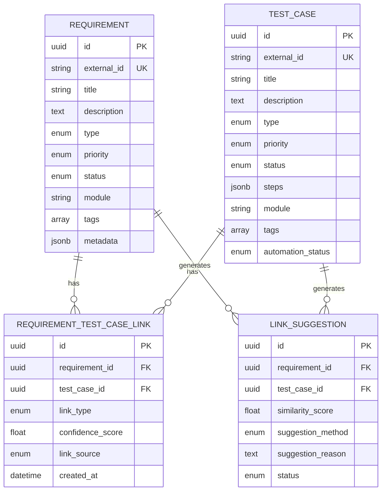

# BGSTM Data Model Architecture

## Entity Relationship Diagram

## Key Relationships

- **Requirement ↔ TestCase**: Many-to-Many via `RequirementTestCaseLink`
- **LinkSuggestion**: Proposes potential links before user confirmation
- **AI Workflow**: Suggestion → Review → Confirmed Link

## Design Principles

1. **Flexibility**: JSONB fields for custom metadata
2. **Traceability**: Full audit trail with timestamps
3. **Performance**: Indexed searches on title/description
4. **Extensibility**: Ready for ML training loop

## Database Support

The data model supports both:
- **PostgreSQL**: Full-featured with native UUID, JSONB, and ENUM types
- **SQLite**: Development-friendly with TEXT-based workarounds

## Core Entities

### Requirements
Captures software requirements from various sources (Jira, Azure DevOps, etc.)

**Key Fields:**
- `external_id`: Links to source system
- `type`: functional, non_functional, technical
- `priority`: critical, high, medium, low
- `status`: draft → approved → implemented → tested → closed
- `metadata`: Extensible JSONB for custom attributes

### Test Cases
Represents test scenarios that validate requirements

**Key Fields:**
- `external_id`: Links to test management system
- `type`: functional, integration, performance, security, ui, regression
- `steps`: Structured test steps in JSONB
- `automation_status`: manual, automated, automatable
- `test_data`: Test input data in JSONB

### Requirement-Test Case Links
Explicit traceability links between requirements and test cases

**Key Fields:**
- `link_type`: covers, verifies, validates, related
- `link_source`: manual, ai_suggested, ai_confirmed, imported
- `confidence_score`: AI confidence (0.0-1.0)
- Unique constraint on (requirement_id, test_case_id)

### Link Suggestions
AI-generated suggestions for potential links

**Key Fields:**
- `similarity_score`: Semantic similarity (0.0-1.0)
- `suggestion_method`: semantic_similarity, keyword_match, heuristic, hybrid
- `status`: pending, accepted, rejected, expired
- `suggestion_reason`: Explanation for the suggestion

## AI Integration Points

1. **Suggestion Generation**: ML models analyze requirements and test cases to generate link suggestions
2. **Confidence Scoring**: Each suggestion includes a confidence score
3. **Human-in-the-Loop**: Users review and accept/reject suggestions
4. **Feedback Loop**: User decisions train future models

## Performance Considerations

- Indexed fields: `external_id`, `title`, `status`, `module`
- Foreign key indexes on all relationship tables
- JSONB indexes can be added for specific metadata queries
- Pagination support in API (skip/limit)

## Security & Audit

- `created_by`, `created_at`, `updated_at` on all entities
- `confirmed_by`, `confirmed_at` on links
- `reviewed_by`, `reviewed_at` on suggestions
- Cascade deletes maintain referential integrity

## Future Enhancements

- Full-text search indexes
- Versioning and change history
- Role-based access control (RBAC)
- Multi-project/organization support
- Advanced analytics tables
