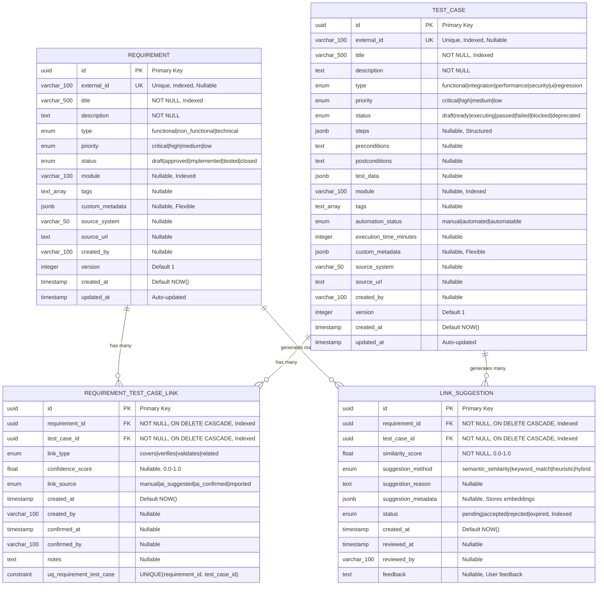
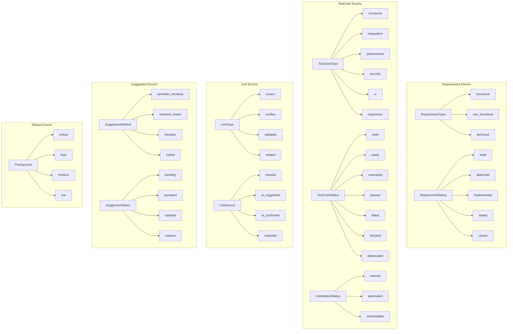
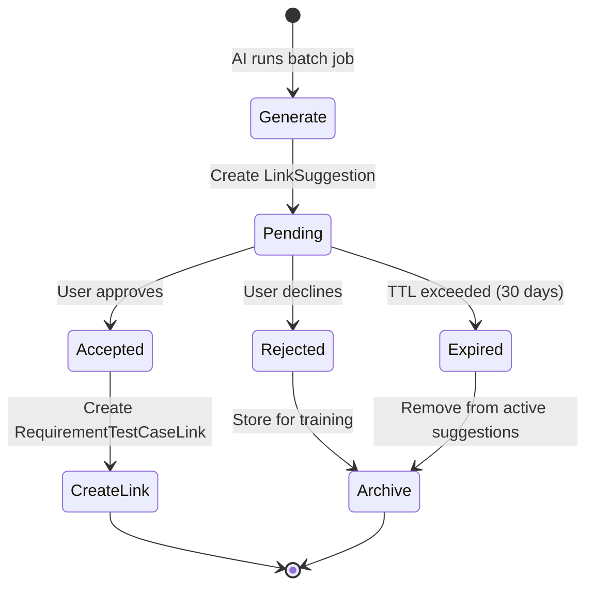
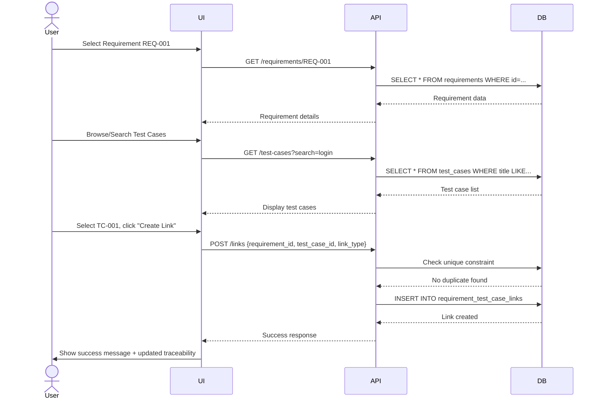
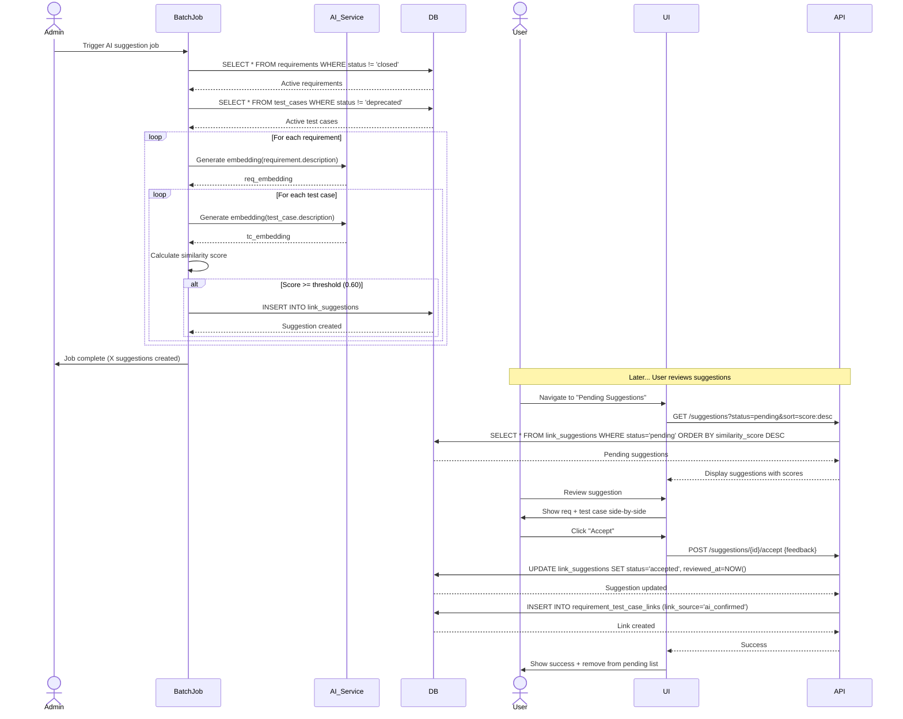
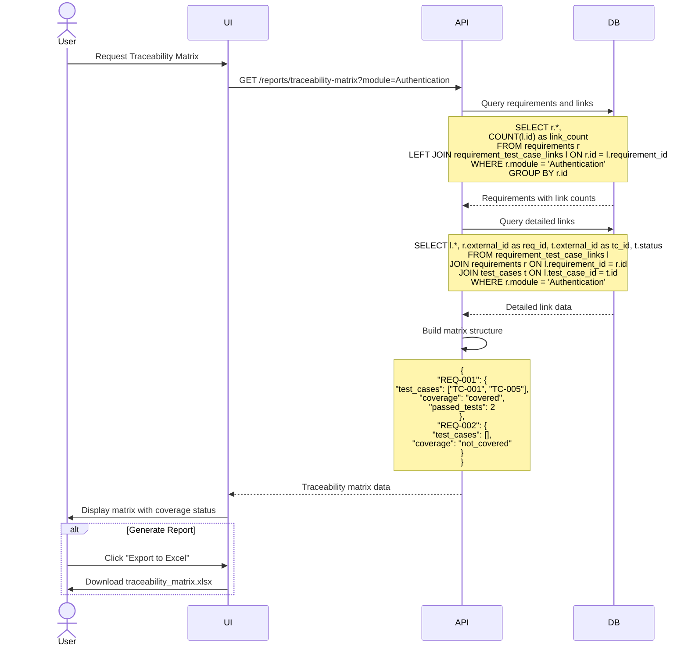

# BGSTM Data Model Architecture

> **Last Updated**: February 2026  
> **Version**: 2.0.0  
> **Related Files**:
> - Models: [`backend/app/models/*.py`](../../backend/app/models/)
> - Schema: [`database/schema.sql`](../../database/schema.sql)
> - Sample Data: [`backend/app/db/sample_data.py`](../../backend/app/db/sample_data.py)

## Table of Contents

1. [Overview](#overview)
2. [Entity Relationship Diagram](#entity-relationship-diagram)
3. [Core Entities](#core-entities)
4. [Design Principles](#design-principles)
5. [AI Integration Points](#ai-integration-points)
6. [Data Flow Diagrams](#data-flow-diagrams)
7. [Common Queries and Use Cases](#common-queries-and-use-cases)
8. [Validation Rules](#validation-rules)
9. [Migration and Evolution](#migration-and-evolution)
10. [Performance Considerations](#performance-considerations)

## Overview

The BGSTM data model is designed to support **AI-powered requirement-to-test case traceability linking**. It enables organizations to:

- Track relationships between requirements and test cases
- Leverage AI/ML to suggest potential links based on semantic similarity
- Maintain a complete audit trail of all traceability activities
- Generate comprehensive traceability matrices and coverage reports
- Support flexible metadata and extensibility for custom workflows

### Key Design Goals

1. **Traceability First**: Every requirement-to-test case relationship is explicitly tracked with full audit trails
2. **AI-Ready**: Fields and structures designed for machine learning integration
3. **Flexible**: JSONB fields and tag arrays allow custom metadata without schema changes
4. **Extensible**: Easy to add new types, statuses, and relationships
5. **Performant**: Indexed for common query patterns and large datasets

## Entity Relationship Diagram

### Enhanced ERD with Full Field Details



### Enum Type Reference



### Relationship Cardinality

| Relationship | Type | Description | Cascade Behavior |
|-------------|------|-------------|------------------|
| Requirement → RequirementTestCaseLink | One-to-Many | One requirement can have many test case links | DELETE CASCADE |
| TestCase → RequirementTestCaseLink | One-to-Many | One test case can link to many requirements | DELETE CASCADE |
| Requirement → LinkSuggestion | One-to-Many | One requirement can have many AI suggestions | DELETE CASCADE |
| TestCase → LinkSuggestion | One-to-Many | One test case can have many AI suggestions | DELETE CASCADE |
| Requirement ↔ TestCase | Many-to-Many | Via RequirementTestCaseLink junction table | Through junction |

### Database Support

The data model supports both:
- **PostgreSQL**: Full-featured with native UUID, JSONB, ENUM types, and ARRAY types
- **SQLite**: Development-friendly with TEXT-based workarounds via custom SQLAlchemy type decorators

SQLAlchemy custom types (`GUID`, `JSON`, `ArrayType`) automatically adapt based on the database dialect.

## Core Entities

### 1. Requirement Entity

**Purpose**: Captures software requirements from various sources (Jira, Azure DevOps, custom systems). Requirements represent the "what" of the system—functional, non-functional, or technical specifications that need to be implemented and validated.

**Use Cases**:
- Import requirements from external systems
- Track requirement status through the development lifecycle
- Link requirements to test cases for traceability
- Generate coverage reports

#### Field Specifications

| Field | Type | Constraints | Description | Business Rules |
|-------|------|-------------|-------------|----------------|
| `id` | UUID | PK, NOT NULL, Default: `uuid4()` | Unique identifier for the requirement | Auto-generated |
| `external_id` | VARCHAR(100) | UNIQUE, Indexed, Nullable | External system identifier (e.g., "JIRA-1234") | Must be unique if provided |
| `title` | VARCHAR(500) | NOT NULL, Indexed | Short descriptive title | Max 500 chars, required |
| `description` | TEXT | NOT NULL | Detailed requirement description | No length limit, required |
| `type` | ENUM | NOT NULL | Type of requirement | One of: `functional`, `non_functional`, `technical` |
| `priority` | ENUM | NOT NULL | Business priority | One of: `critical`, `high`, `medium`, `low` |
| `status` | ENUM | NOT NULL, Default: `draft` | Current lifecycle status | One of: `draft`, `approved`, `implemented`, `tested`, `closed` |
| `module` | VARCHAR(100) | Nullable, Indexed | Module or component name | Used for organizing requirements |
| `tags` | TEXT[] | Nullable | Array of custom tags | Flexible categorization |
| `custom_metadata` | JSONB | Nullable | Extensible metadata | Store any custom fields as JSON |
| `source_system` | VARCHAR(50) | Nullable | Origin system name | e.g., "Jira", "Azure DevOps", "Custom" |
| `source_url` | TEXT | Nullable | URL to source requirement | Deep link to original requirement |
| `created_by` | VARCHAR(100) | Nullable | Username who created it | For audit trail |
| `version` | INTEGER | Default: 1 | Version number | Increment on major changes |
| `created_at` | TIMESTAMP | NOT NULL, Default: NOW() | Creation timestamp | Auto-set on insert |
| `updated_at` | TIMESTAMP | NOT NULL, Default: NOW() | Last update timestamp | Auto-updated on change |

#### RequirementType Enum

| Value | Description | Use Case |
|-------|-------------|----------|
| `functional` | Functional requirements describing system behavior | "User can log in with email/password" |
| `non_functional` | Quality attributes (performance, security, usability) | "System must support 10,000 concurrent users" |
| `technical` | Technical constraints or implementation requirements | "Must use PostgreSQL 14+" |

#### RequirementStatus Enum

| Value | Description | Typical Transition |
|-------|-------------|-------------------|
| `draft` | Initial state, not yet reviewed | → `approved` |
| `approved` | Reviewed and approved for implementation | → `implemented` |
| `implemented` | Code implemented but not tested | → `tested` |
| `tested` | Testing complete and passed | → `closed` |
| `closed` | Requirement fully delivered | Terminal state |

#### Relationships

- **One-to-Many with RequirementTestCaseLink**: `requirement.links` (back_populates="requirement")
  - Cascade: `all, delete-orphan` (deleting requirement removes all its links)
- **One-to-Many with LinkSuggestion**: `requirement.suggestions` (back_populates="requirement")
  - Cascade: `all, delete-orphan` (deleting requirement removes all its suggestions)

#### Example Data

```json
{
  "id": "550e8400-e29b-41d4-a716-446655440000",
  "external_id": "REQ-001",
  "title": "User Authentication System",
  "description": "Implement secure user authentication with email/password login, OAuth support (Google, Facebook), password reset functionality, and session management. Must include 2FA option.",
  "type": "functional",
  "priority": "critical",
  "status": "approved",
  "module": "Authentication",
  "tags": ["security", "user-management", "login"],
  "custom_metadata": {
    "complexity": "high",
    "estimated_hours": 40,
    "sprint": 5
  },
  "source_system": "Jira",
  "source_url": "https://company.atlassian.net/browse/REQ-001",
  "created_by": "product_manager",
  "version": 1,
  "created_at": "2026-01-15T10:00:00Z",
  "updated_at": "2026-01-20T14:30:00Z"
}
```

---

### 2. TestCase Entity

**Purpose**: Represents test scenarios that validate requirements. Test cases describe the "how" of validation—specific steps, conditions, and expected outcomes to verify system behavior.

**Use Cases**:
- Create manual or automated test cases
- Link test cases to requirements for coverage tracking
- Track test execution status
- Generate test reports and metrics

#### Field Specifications

| Field | Type | Constraints | Description | Business Rules |
|-------|------|-------------|-------------|----------------|
| `id` | UUID | PK, NOT NULL, Default: `uuid4()` | Unique identifier for test case | Auto-generated |
| `external_id` | VARCHAR(100) | UNIQUE, Indexed, Nullable | External system identifier (e.g., "TC-5678") | Must be unique if provided |
| `title` | VARCHAR(500) | NOT NULL, Indexed | Descriptive test case title | Max 500 chars, required |
| `description` | TEXT | NOT NULL | Detailed test case description | No length limit, required |
| `type` | ENUM | NOT NULL | Type of test | One of: `functional`, `integration`, `performance`, `security`, `ui`, `regression` |
| `priority` | ENUM | NOT NULL | Test priority | One of: `critical`, `high`, `medium`, `low` |
| `status` | ENUM | NOT NULL, Default: `draft` | Current execution status | One of: `draft`, `ready`, `executing`, `passed`, `failed`, `blocked`, `deprecated` |
| `steps` | JSONB | Nullable | Structured test steps | JSON object with step numbers as keys |
| `preconditions` | TEXT | Nullable | Prerequisites for execution | What must be true before test |
| `postconditions` | TEXT | Nullable | Expected state after test | What should be true after test |
| `test_data` | JSONB | Nullable | Test input data | JSON with test data values |
| `module` | VARCHAR(100) | Nullable, Indexed | Module or component name | Used for organizing test cases |
| `tags` | TEXT[] | Nullable | Array of custom tags | Flexible categorization |
| `automation_status` | ENUM | Default: `manual` | Automation state | One of: `manual`, `automated`, `automatable` |
| `execution_time_minutes` | INTEGER | Nullable | Expected execution time | In minutes |
| `custom_metadata` | JSONB | Nullable | Extensible metadata | Store any custom fields as JSON |
| `source_system` | VARCHAR(50) | Nullable | Origin system name | e.g., "TestRail", "Zephyr", "Custom" |
| `source_url` | TEXT | Nullable | URL to source test case | Deep link to original test case |
| `created_by` | VARCHAR(100) | Nullable | Username who created it | For audit trail |
| `version` | INTEGER | Default: 1 | Version number | Increment on major changes |
| `created_at` | TIMESTAMP | NOT NULL, Default: NOW() | Creation timestamp | Auto-set on insert |
| `updated_at` | TIMESTAMP | NOT NULL, Default: NOW() | Last update timestamp | Auto-updated on change |

#### TestCaseType Enum

| Value | Description | Use Case |
|-------|-------------|----------|
| `functional` | Validates functional requirements | Feature testing |
| `integration` | Tests interaction between components | API integration tests |
| `performance` | Validates performance requirements | Load/stress testing |
| `security` | Security and vulnerability testing | Penetration testing |
| `ui` | User interface and UX testing | Visual regression tests |
| `regression` | Ensures existing features still work | After changes/updates |

#### TestCaseStatus Enum

| Value | Description | Typical Transition |
|-------|-------------|-------------------|
| `draft` | Being written, not ready for execution | → `ready` |
| `ready` | Ready to be executed | → `executing` |
| `executing` | Currently being executed | → `passed`, `failed`, `blocked` |
| `passed` | Test passed successfully | Terminal (until re-run) |
| `failed` | Test failed | → `ready` (after fix) |
| `blocked` | Cannot execute due to dependency | → `ready` (when unblocked) |
| `deprecated` | No longer relevant/maintained | Terminal state |

#### AutomationStatus Enum

| Value | Description | Typical Use |
|-------|-------------|-------------|
| `manual` | Must be executed manually | UI tests, exploratory tests |
| `automated` | Fully automated test | CI/CD pipeline tests |
| `automatable` | Can be automated but not yet done | Candidate for automation |

#### Relationships

- **One-to-Many with RequirementTestCaseLink**: `test_case.links` (back_populates="test_case")
  - Cascade: `all, delete-orphan` (deleting test case removes all its links)
- **One-to-Many with LinkSuggestion**: `test_case.suggestions` (back_populates="test_case")
  - Cascade: `all, delete-orphan` (deleting test case removes all its suggestions)

#### Example Data

```json
{
  "id": "660e8400-e29b-41d4-a716-446655440001",
  "external_id": "TC-001",
  "title": "Verify User Login with Valid Credentials",
  "description": "Test successful login flow with valid email and password. Verify session creation, user dashboard access, and proper token generation.",
  "type": "functional",
  "priority": "critical",
  "status": "passed",
  "steps": {
    "1": "Navigate to login page",
    "2": "Enter valid email address",
    "3": "Enter valid password",
    "4": "Click 'Login' button",
    "5": "Verify redirection to dashboard"
  },
  "preconditions": "User account exists in the database",
  "postconditions": "User is logged in and session is active",
  "test_data": {
    "email": "test@example.com",
    "password": "Test@123"
  },
  "module": "Authentication",
  "tags": ["login", "smoke-test", "critical"],
  "automation_status": "automated",
  "execution_time_minutes": 5,
  "custom_metadata": {
    "last_execution": "2026-02-10T15:30:00Z",
    "test_suite": "regression"
  },
  "source_system": "TestRail",
  "source_url": "https://company.testrail.io/index.php?/cases/view/1",
  "created_by": "qa_engineer",
  "version": 2,
  "created_at": "2026-01-15T11:00:00Z",
  "updated_at": "2026-02-10T15:30:00Z"
}
```

---

### 3. RequirementTestCaseLink Entity

**Purpose**: Explicit traceability links between requirements and test cases. This junction table enables many-to-many relationships and tracks the nature and confidence of each link.

**Use Cases**:
- Create manual traceability links
- Convert AI suggestions to confirmed links
- Generate traceability matrices
- Track test coverage per requirement

#### Field Specifications

| Field | Type | Constraints | Description | Business Rules |
|-------|------|-------------|-------------|----------------|
| `id` | UUID | PK, NOT NULL, Default: `uuid4()` | Unique identifier for link | Auto-generated |
| `requirement_id` | UUID | FK, NOT NULL, Indexed, ON DELETE CASCADE | Reference to requirement | Must exist in requirements table |
| `test_case_id` | UUID | FK, NOT NULL, Indexed, ON DELETE CASCADE | Reference to test case | Must exist in test_cases table |
| `link_type` | ENUM | NOT NULL, Default: `covers` | Nature of the relationship | One of: `covers`, `verifies`, `validates`, `related` |
| `confidence_score` | FLOAT | Nullable, Range: 0.0-1.0 | AI confidence (if AI-created) | 1.0 for manual, 0.0-1.0 for AI |
| `link_source` | ENUM | NOT NULL | How link was created | One of: `manual`, `ai_suggested`, `ai_confirmed`, `imported` |
| `created_at` | TIMESTAMP | NOT NULL, Default: NOW() | When link was created | Auto-set on insert |
| `created_by` | VARCHAR(100) | Nullable | Username who created link | For audit trail |
| `confirmed_at` | TIMESTAMP | Nullable | When link was confirmed | Set when AI suggestion accepted |
| `confirmed_by` | VARCHAR(100) | Nullable | Username who confirmed | For AI-suggested links |
| `notes` | TEXT | Nullable | Additional notes or context | Free-form notes |

#### Unique Constraint

- **uq_requirement_test_case**: UNIQUE(requirement_id, test_case_id)
  - Prevents duplicate links between same requirement and test case pair

#### LinkType Enum

| Value | Description | Use Case |
|-------|-------------|----------|
| `covers` | Test case covers requirement | Direct coverage relationship |
| `verifies` | Test case verifies requirement implementation | Validation testing |
| `validates` | Test case validates requirement completeness | Acceptance testing |
| `related` | Indirect or supporting relationship | Related but not direct coverage |

#### LinkSource Enum

| Value | Description | confidence_score |
|-------|-------------|------------------|
| `manual` | Created by user directly | 1.0 (full confidence) |
| `ai_suggested` | AI generated, awaiting approval | N/A (use suggestion table) |
| `ai_confirmed` | AI suggested, user accepted | From original suggestion |
| `imported` | Imported from external system | 1.0 or from import |

#### Relationships

- **Many-to-One with Requirement**: `link.requirement` (back_populates="links")
- **Many-to-One with TestCase**: `link.test_case` (back_populates="links")

#### Example Data

```json
{
  "id": "770e8400-e29b-41d4-a716-446655440002",
  "requirement_id": "550e8400-e29b-41d4-a716-446655440000",
  "test_case_id": "660e8400-e29b-41d4-a716-446655440001",
  "link_type": "covers",
  "confidence_score": 1.0,
  "link_source": "manual",
  "created_at": "2026-01-22T09:00:00Z",
  "created_by": "qa_engineer",
  "confirmed_at": null,
  "confirmed_by": null,
  "notes": "Direct coverage of login functionality"
}
```

---

### 4. LinkSuggestion Entity

**Purpose**: AI-generated suggestions for potential requirement-test case links. Represents the "pending" state before human review and approval. This enables a human-in-the-loop workflow for AI-assisted traceability.

**Use Cases**:
- AI generates suggestions based on semantic similarity
- Users review and accept/reject suggestions
- Track AI model performance and accuracy
- Improve models based on user feedback

#### Field Specifications

| Field | Type | Constraints | Description | Business Rules |
|-------|------|-------------|-------------|----------------|
| `id` | UUID | PK, NOT NULL, Default: `uuid4()` | Unique identifier for suggestion | Auto-generated |
| `requirement_id` | UUID | FK, NOT NULL, Indexed, ON DELETE CASCADE | Reference to requirement | Must exist in requirements table |
| `test_case_id` | UUID | FK, NOT NULL, Indexed, ON DELETE CASCADE | Reference to test case | Must exist in test_cases table |
| `similarity_score` | FLOAT | NOT NULL, Range: 0.0-1.0 | AI confidence score | Higher = more confident match |
| `suggestion_method` | ENUM | NOT NULL | Algorithm used | One of: `semantic_similarity`, `keyword_match`, `heuristic`, `hybrid` |
| `suggestion_reason` | TEXT | Nullable | Human-readable explanation | Why AI suggests this link |
| `suggestion_metadata` | JSONB | Nullable | Algorithm-specific data | Store embeddings, matched keywords, etc. |
| `status` | ENUM | NOT NULL, Default: `pending`, Indexed | Review status | One of: `pending`, `accepted`, `rejected`, `expired` |
| `created_at` | TIMESTAMP | NOT NULL, Default: NOW() | When suggestion was created | Auto-set on insert |
| `reviewed_at` | TIMESTAMP | Nullable | When user reviewed | Set on accept/reject |
| `reviewed_by` | VARCHAR(100) | Nullable | Username who reviewed | For audit trail |
| `feedback` | TEXT | Nullable | User feedback on suggestion | Why accepted/rejected |

#### SuggestionMethod Enum

| Value | Description | Typical Use Case |
|-------|-------------|------------------|
| `semantic_similarity` | Uses embeddings and cosine similarity | Most accurate for natural language |
| `keyword_match` | Matches specific keywords/terms | Fast, simple matching |
| `heuristic` | Rule-based matching | Custom business rules |
| `hybrid` | Combines multiple methods | Best overall accuracy |

#### SuggestionStatus Enum

| Value | Description | Next Action |
|-------|-------------|-------------|
| `pending` | Awaiting user review | Display in UI for review |
| `accepted` | User confirmed link | Create RequirementTestCaseLink |
| `rejected` | User declined link | Archive, use for training |
| `expired` | Suggestion too old or outdated | Archive, may regenerate |

#### Relationships

- **Many-to-One with Requirement**: `suggestion.requirement` (back_populates="suggestions")
- **Many-to-One with TestCase**: `suggestion.test_case` (back_populates="suggestions")

#### Example Data

```json
{
  "id": "880e8400-e29b-41d4-a716-446655440003",
  "requirement_id": "550e8400-e29b-41d4-a716-446655440000",
  "test_case_id": "660e8400-e29b-41d4-a716-446655440001",
  "similarity_score": 0.87,
  "suggestion_method": "semantic_similarity",
  "suggestion_reason": "High semantic similarity between requirement description and test case title. Matched concepts: authentication, login, user credentials.",
  "suggestion_metadata": {
    "embedding_distance": 0.13,
    "matched_keywords": ["authentication", "login", "password", "user"],
    "model_version": "sentence-transformers/all-mpnet-base-v2"
  },
  "status": "pending",
  "created_at": "2026-02-15T08:00:00Z",
  "reviewed_at": null,
  "reviewed_by": null,
  "feedback": null
}
```

## Design Principles

### 1. Traceability First

The data model is built around **explicit traceability** as a first-class concept:

- **Many-to-Many Relationships**: Requirements and test cases can have multiple links (e.g., one requirement covered by multiple tests, one test validating multiple requirements)
- **Link Types**: Different types of relationships (`covers`, `verifies`, `validates`, `related`) provide semantic meaning
- **Unique Constraints**: `(requirement_id, test_case_id)` uniqueness prevents duplicate links
- **Bi-directional Navigation**: SQLAlchemy relationships enable easy querying in both directions

**Benefits**:
- Generate comprehensive traceability matrices
- Calculate test coverage per requirement
- Identify gaps (requirements without tests, orphaned tests)
- Track impact of requirement changes

### 2. AI-Ready Design

Fields and structures specifically designed for AI/ML integration:

#### Embedding Storage
- **`suggestion_metadata` JSONB**: Stores ML model embeddings, feature vectors, and intermediate results
- Example: Store sentence transformer embeddings as arrays in JSON
- Flexible schema allows different ML models without database changes

#### Similarity Scoring
- **`similarity_score` (0.0-1.0)**: Normalized confidence metric
  - 0.0 = No confidence
  - 0.5 = Moderate confidence
  - 1.0 = Perfect match (manual links)
- **`confidence_score` in links**: Preserves AI confidence even after acceptance

#### Suggestion Methods
- **`suggestion_method` enum**: Tracks which algorithm generated the suggestion
- Enables A/B testing and model comparison
- Types: `semantic_similarity`, `keyword_match`, `heuristic`, `hybrid`

#### Feedback Loop
- **`feedback` field**: Captures user reasoning for accept/reject decisions
- **`reviewed_by` and `reviewed_at`**: Tracks who and when
- This data trains future models (supervised learning)

**Benefits**:
- Support multiple ML approaches simultaneously
- Track model performance and accuracy
- Improve models based on user feedback
- Experiment with new algorithms without schema changes

### 3. Audit Trail

Complete audit trail for compliance and accountability:

| Entity | Audit Fields | Purpose |
|--------|-------------|---------|
| **All Entities** | `created_at`, `created_by` | Who created and when |
| **Requirement & TestCase** | `updated_at`, `version` | Track changes over time |
| **Link** | `confirmed_at`, `confirmed_by` | Track AI link approvals |
| **Suggestion** | `reviewed_at`, `reviewed_by` | Track review decisions |

**Benefits**:
- Compliance with regulatory requirements (FDA, ISO)
- Debug and troubleshoot issues
- Understand system usage patterns
- Generate audit reports

### 4. Flexibility via JSONB and Arrays

Extensibility without schema migrations:

#### JSONB Fields
- **`custom_metadata`**: Store any custom fields per organization
- **`steps`**: Structured test steps (numbered, nested, conditional)
- **`test_data`**: Test inputs, expected outputs, configurations
- **`suggestion_metadata`**: ML model data, embeddings, features

Example `custom_metadata`:
```json
{
  "complexity": "high",
  "estimated_hours": 40,
  "sprint": 5,
  "epic_id": "EPIC-123",
  "acceptance_criteria": ["AC1", "AC2"],
  "regulatory_tag": "FDA-21-CFR-Part-11"
}
```

#### Array Fields
- **`tags`**: Flexible categorization without predefined enums
- Example: `["security", "GDPR", "critical-path", "smoke-test"]`

**Benefits**:
- No schema changes for custom fields
- Each organization can extend the model
- Supports evolving requirements
- Fast queries on JSONB (indexed where needed)

### 5. Extensibility

Easy to extend the model for new use cases:

#### Adding New Enums
To add a new requirement type:
1. Add to `RequirementType` enum in `backend/app/models/requirement.py`
2. Run Alembic migration to update PostgreSQL enum
3. Update API schemas in `backend/app/schemas/requirement.py`

#### Adding New Entities
Follow the pattern:
1. Create new model inheriting from `Base` and `TimestampMixin`
2. Add relationships to existing entities
3. Create migration
4. Add API endpoints

Example: Adding a "Defect" entity linked to test cases

#### Versioning Strategy
- **`version` field**: Simple integer versioning for requirements/test cases
- Future: Add `requirement_history` table for full change tracking

**Benefits**:
- Adapt to changing business needs
- Support new testing methodologies
- Integrate with new external systems
- Scale from small teams to enterprises

### 6. Performance Optimization

Indexes on high-frequency query fields:

| Table | Indexed Fields | Purpose |
|-------|----------------|---------|
| **requirements** | `external_id`, `title`, `status`, `module` | Fast lookups and filtering |
| **test_cases** | `external_id`, `title`, `status`, `module` | Fast lookups and filtering |
| **requirement_test_case_links** | `requirement_id`, `test_case_id` | Fast join queries |
| **link_suggestions** | `requirement_id`, `test_case_id`, `status` | Fast pending suggestions query |

**Query Patterns**:
- Get all test cases for a requirement: Index on `requirement_id`
- Find requirements without tests: Left join with count
- Get pending suggestions: Index on `status`
- Search by title: Index on `title` (can add full-text search)

**Benefits**:
- Sub-second queries even with 100,000+ entities
- Efficient traceability matrix generation
- Fast AI suggestion retrieval
- Scales to enterprise datasets

---

## AI Integration Points

### How AI Uses the Data Model

The BGSTM data model is designed to support **AI-assisted requirement-test case linking** through a human-in-the-loop workflow.

### 1. Embedding Storage

**Where**: `LinkSuggestion.suggestion_metadata` JSONB field

**What to Store**:
```json
{
  "embedding_distance": 0.13,
  "requirement_embedding": [0.123, -0.456, 0.789, ...],  // 768-dim vector
  "test_case_embedding": [0.234, -0.567, 0.890, ...],    // 768-dim vector
  "matched_keywords": ["authentication", "login", "password"],
  "model_version": "sentence-transformers/all-mpnet-base-v2",
  "model_timestamp": "2026-02-15T08:00:00Z"
}
```

**Recommended Models**:
- **Sentence Transformers**: `all-mpnet-base-v2` (768-dim, general purpose)
- **OpenAI**: `text-embedding-ada-002` (1536-dim, high quality)
- **Custom**: Fine-tuned models on domain-specific data

**Storage Considerations**:
- JSONB is efficient for storing arrays (embeddings)
- Can be indexed with GIN indexes for metadata queries
- For vector similarity search at scale, consider pgvector extension

### 2. Similarity Scoring

**Field**: `similarity_score` (FLOAT, 0.0-1.0)

**Interpretation**:

| Score Range | Confidence Level | UI Display | Action |
|-------------|------------------|------------|--------|
| 0.90 - 1.00 | Very High | 🟢 Green | Auto-suggest with high priority |
| 0.75 - 0.89 | High | 🟡 Yellow | Strong suggestion |
| 0.60 - 0.74 | Moderate | 🟠 Orange | Review recommended |
| 0.00 - 0.59 | Low | 🔴 Red | Low priority or skip |

**Calculation Methods**:

1. **Cosine Similarity** (most common):
   ```python
   from sklearn.metrics.pairwise import cosine_similarity
   score = cosine_similarity([req_embedding], [tc_embedding])[0][0]
   ```

2. **Euclidean Distance** (convert to 0-1):
   ```python
   distance = np.linalg.norm(req_embedding - tc_embedding)
   score = 1 / (1 + distance)
   ```

3. **Dot Product** (normalized):
   ```python
   score = np.dot(req_embedding, tc_embedding)
   ```

### 3. Suggestion Methods

**Field**: `suggestion_method` enum

#### semantic_similarity
- **Description**: Uses NLP embeddings and cosine similarity
- **Best For**: Natural language requirements and test cases
- **Algorithm**:
  1. Generate embeddings for requirement description
  2. Generate embeddings for test case description
  3. Calculate cosine similarity
  4. Threshold at 0.60+ for suggestions

#### keyword_match
- **Description**: TF-IDF or keyword extraction with overlap scoring
- **Best For**: Structured requirements with specific terminology
- **Algorithm**:
  1. Extract keywords from requirement (noun phrases, technical terms)
  2. Extract keywords from test case
  3. Calculate Jaccard similarity or weighted overlap
  4. Threshold at 0.50+ for suggestions

#### heuristic
- **Description**: Rule-based matching (module, tags, external_id patterns)
- **Best For**: Structured data with consistent naming conventions
- **Algorithm**:
  1. Match on `module` field (if same module, +0.3 score)
  2. Match on `tags` overlap (percentage of shared tags)
  3. Match on `priority` (same priority, +0.1 score)
  4. Combine scores with weights

#### hybrid
- **Description**: Combines multiple methods with weighted average
- **Best For**: Maximum accuracy across diverse data
- **Algorithm**:
  1. Run all three methods
  2. Weighted average: `0.6 * semantic + 0.3 * keyword + 0.1 * heuristic`
  3. Threshold at 0.65+ for suggestions

### 4. Suggestion Workflow



**Step-by-Step Process**:

1. **Generation Phase** (Batch Job):
   ```python
   # Pseudo-code
   for requirement in requirements:
       req_embedding = model.encode(requirement.description)
       for test_case in test_cases:
           tc_embedding = model.encode(test_case.description)
           score = cosine_similarity(req_embedding, tc_embedding)
           if score >= threshold:
               suggestion = LinkSuggestion(
                   requirement_id=requirement.id,
                   test_case_id=test_case.id,
                   similarity_score=score,
                   suggestion_method="semantic_similarity",
                   status="pending"
               )
               db.add(suggestion)
   ```

2. **Review Phase** (User Interface):
   - Display suggestions sorted by `similarity_score` DESC
   - Show requirement and test case side-by-side
   - User clicks "Accept" or "Reject"
   - Optionally collect `feedback` text

3. **Acceptance Phase**:
   - Update suggestion: `status = "accepted"`, `reviewed_at = NOW()`, `reviewed_by = user`
   - Create link:
     ```python
     link = RequirementTestCaseLink(
         requirement_id=suggestion.requirement_id,
         test_case_id=suggestion.test_case_id,
         link_type="covers",  # or user-selected
         confidence_score=suggestion.similarity_score,
         link_source="ai_confirmed",
         created_by=user
     )
     ```

4. **Rejection Phase**:
   - Update suggestion: `status = "rejected"`, `reviewed_at = NOW()`, `reviewed_by = user`
   - Store `feedback` if provided
   - Use for model retraining (negative examples)

5. **Expiration Phase** (Cleanup Job):
   - Find suggestions with `status = "pending"` AND `created_at < NOW() - 30 days`
   - Update: `status = "expired"`
   - Optionally archive to separate table

### 5. Confidence Levels for UI Display

**Visual Indicators**:

```
🟢 High Confidence (0.85+)
   "Strong match based on semantic similarity"
   → Show at top of list
   → Consider "quick accept" button

🟡 Medium-High (0.75-0.84)
   "Good match, review recommended"
   → Show in main list
   → Standard accept/reject flow

🟠 Medium (0.65-0.74)
   "Possible match, manual review needed"
   → Show in expanded list
   → Add warning icon

🔴 Low (0.60-0.64)
   "Weak match, may not be relevant"
   → Show in "More suggestions" section
   → De-emphasize visually
```

**UI Component Example**:

```jsx
<SuggestionCard
  requirement={req}
  testCase={tc}
  score={0.87}
  method="semantic_similarity"
  reason="High semantic similarity: matched concepts include authentication, login, user credentials"
  onAccept={() => acceptSuggestion(suggestionId)}
  onReject={() => rejectSuggestion(suggestionId)}
  confidence={getConfidenceLevel(0.87)}  // Returns "high"
/>
```

**Batch Actions**:
- "Accept all high-confidence suggestions (0.85+)"
- "Reject all low-confidence suggestions (< 0.65)"
- "Review medium suggestions"

### 6. Model Performance Tracking

**Metrics to Calculate**:

```sql
-- Acceptance rate by score range
SELECT 
    CASE 
        WHEN similarity_score >= 0.85 THEN 'High'
        WHEN similarity_score >= 0.75 THEN 'Medium-High'
        WHEN similarity_score >= 0.65 THEN 'Medium'
        ELSE 'Low'
    END as confidence_level,
    COUNT(*) as total_suggestions,
    SUM(CASE WHEN status = 'accepted' THEN 1 ELSE 0 END) as accepted,
    ROUND(100.0 * SUM(CASE WHEN status = 'accepted' THEN 1 ELSE 0 END) / COUNT(*), 2) as acceptance_rate
FROM link_suggestions
WHERE status IN ('accepted', 'rejected')
GROUP BY confidence_level;
```

**Use Results**:
- Adjust score thresholds
- Tune model weights (for hybrid method)
- Retrain models on accepted/rejected examples
- A/B test different models

---

## Data Flow Diagrams

### 1. Manual Link Creation Flow



**Key Points**:
- User has full control
- `link_source = "manual"`
- `confidence_score = 1.0`
- Instant creation (no review needed)

### 2. AI Suggestion Flow



**Key Points**:
- AI job runs asynchronously (batch or scheduled)
- Suggestions are `pending` until reviewed
- User makes final decision
- Accepted suggestions create links with `link_source = "ai_confirmed"`

### 3. Traceability Matrix Generation Flow



**Key Points**:
- Uses LEFT JOIN to find requirements without test coverage
- Aggregates link counts and test statuses
- Can filter by module, priority, status
- Supports export formats (JSON, Excel, PDF)

---

## Common Queries and Use Cases

### 1. Get All Test Cases Linked to a Requirement

**Use Case**: Display all test cases that validate a specific requirement

**SQL**:
```sql
SELECT 
    tc.id,
    tc.external_id,
    tc.title,
    tc.status,
    tc.automation_status,
    l.link_type,
    l.confidence_score,
    l.created_at
FROM test_cases tc
INNER JOIN requirement_test_case_links l ON tc.id = l.test_case_id
WHERE l.requirement_id = '550e8400-e29b-41d4-a716-446655440000'
ORDER BY l.link_type, tc.priority DESC;
```

**SQLAlchemy (Python)**:
```python
from sqlalchemy.orm import selectinload

requirement = session.query(Requirement).options(
    selectinload(Requirement.links).selectinload(RequirementTestCaseLink.test_case)
).filter(
    Requirement.id == requirement_id
).first()

for link in requirement.links:
    print(f"{link.test_case.external_id}: {link.test_case.title} [{link.link_type}]")
```

**API Endpoint**: `GET /requirements/{id}/test-cases`

---

### 2. Find Requirements with No Test Coverage

**Use Case**: Identify requirements that need test cases (coverage gap analysis)

**SQL**:
```sql
SELECT 
    r.id,
    r.external_id,
    r.title,
    r.priority,
    r.status,
    r.module
FROM requirements r
LEFT JOIN requirement_test_case_links l ON r.id = l.requirement_id
WHERE l.id IS NULL
  AND r.status IN ('approved', 'implemented', 'tested')
ORDER BY r.priority, r.created_at;
```

**SQLAlchemy (Python)**:
```python
from sqlalchemy import and_, or_
from sqlalchemy.orm import outerjoin

uncovered_requirements = session.query(Requirement).outerjoin(
    RequirementTestCaseLink
).filter(
    RequirementTestCaseLink.id.is_(None),
    Requirement.status.in_(['approved', 'implemented', 'tested'])
).order_by(
    Requirement.priority, Requirement.created_at
).all()
```

**API Endpoint**: `GET /requirements?coverage=none&status=approved,implemented,tested`

---

### 3. Get Pending AI Suggestions Sorted by Confidence

**Use Case**: Display pending suggestions for user review, highest confidence first

**SQL**:
```sql
SELECT 
    s.id,
    s.similarity_score,
    s.suggestion_method,
    s.suggestion_reason,
    s.created_at,
    r.external_id as req_id,
    r.title as req_title,
    tc.external_id as tc_id,
    tc.title as tc_title
FROM link_suggestions s
INNER JOIN requirements r ON s.requirement_id = r.id
INNER JOIN test_cases tc ON s.test_case_id = tc.id
WHERE s.status = 'pending'
  AND s.similarity_score >= 0.65
ORDER BY s.similarity_score DESC, s.created_at DESC
LIMIT 50;
```

**SQLAlchemy (Python)**:
```python
from sqlalchemy.orm import joinedload

pending_suggestions = session.query(LinkSuggestion).options(
    joinedload(LinkSuggestion.requirement),
    joinedload(LinkSuggestion.test_case)
).filter(
    LinkSuggestion.status == SuggestionStatus.PENDING,
    LinkSuggestion.similarity_score >= 0.65
).order_by(
    LinkSuggestion.similarity_score.desc(),
    LinkSuggestion.created_at.desc()
).limit(50).all()
```

**API Endpoint**: `GET /suggestions?status=pending&min_score=0.65&sort=score:desc&limit=50`

---

### 4. Generate Traceability Matrix Data

**Use Case**: Create a comprehensive requirement-to-test case traceability report

**SQL**:
```sql
SELECT 
    r.external_id as requirement_id,
    r.title as requirement_title,
    r.priority as requirement_priority,
    r.status as requirement_status,
    STRING_AGG(tc.external_id, ', ' ORDER BY tc.external_id) as linked_test_cases,
    COUNT(l.id) as test_case_count,
    COUNT(CASE WHEN tc.status = 'passed' THEN 1 END) as passed_count,
    COUNT(CASE WHEN tc.status = 'failed' THEN 1 END) as failed_count,
    CASE 
        WHEN COUNT(l.id) = 0 THEN 'Not Covered'
        WHEN COUNT(CASE WHEN tc.status = 'passed' THEN 1 END) = COUNT(l.id) THEN 'Fully Tested'
        WHEN COUNT(CASE WHEN tc.status = 'failed' THEN 1 END) > 0 THEN 'Issues Found'
        ELSE 'Partial Coverage'
    END as coverage_status
FROM requirements r
LEFT JOIN requirement_test_case_links l ON r.id = l.requirement_id
LEFT JOIN test_cases tc ON l.test_case_id = tc.id
WHERE r.status != 'closed'
GROUP BY r.id, r.external_id, r.title, r.priority, r.status
ORDER BY r.priority, r.external_id;
```

**API Endpoint**: `GET /reports/traceability-matrix?format=json`

---

### 5. Find Orphaned Test Cases (No Requirement Links)

**Use Case**: Identify test cases that aren't linked to any requirements

**SQL**:
```sql
SELECT 
    tc.id,
    tc.external_id,
    tc.title,
    tc.type,
    tc.status,
    tc.module,
    tc.created_at
FROM test_cases tc
LEFT JOIN requirement_test_case_links l ON tc.id = l.test_case_id
WHERE l.id IS NULL
  AND tc.status NOT IN ('deprecated', 'draft')
ORDER BY tc.priority, tc.created_at;
```

**SQLAlchemy (Python)**:
```python
orphaned_test_cases = session.query(TestCase).outerjoin(
    RequirementTestCaseLink
).filter(
    RequirementTestCaseLink.id.is_(None),
    TestCase.status.notin_(['deprecated', 'draft'])
).order_by(
    TestCase.priority, TestCase.created_at
).all()
```

**API Endpoint**: `GET /test-cases?linked=false&status=!deprecated,!draft`

---

### 6. Get Test Coverage Percentage by Module

**Use Case**: Calculate test coverage metrics per module

**SQL**:
```sql
WITH module_stats AS (
    SELECT 
        r.module,
        COUNT(DISTINCT r.id) as total_requirements,
        COUNT(DISTINCT CASE WHEN l.id IS NOT NULL THEN r.id END) as covered_requirements
    FROM requirements r
    LEFT JOIN requirement_test_case_links l ON r.id = l.requirement_id
    WHERE r.status IN ('approved', 'implemented', 'tested')
    GROUP BY r.module
)
SELECT 
    module,
    total_requirements,
    covered_requirements,
    ROUND(100.0 * covered_requirements / NULLIF(total_requirements, 0), 2) as coverage_percentage
FROM module_stats
ORDER BY coverage_percentage, module;
```

**API Endpoint**: `GET /reports/coverage-by-module`

---

### 7. Find Duplicate or Similar Links

**Use Case**: Identify potential duplicate links (same requirement-testcase pair)

**SQL**:
```sql
-- This should return 0 rows due to unique constraint, but useful for debugging
SELECT 
    requirement_id,
    test_case_id,
    COUNT(*) as link_count
FROM requirement_test_case_links
GROUP BY requirement_id, test_case_id
HAVING COUNT(*) > 1;
```

---

### 8. Get AI Suggestion Acceptance Rate

**Use Case**: Track AI model performance and accuracy

**SQL**:
```sql
SELECT 
    suggestion_method,
    CASE 
        WHEN similarity_score >= 0.85 THEN 'Very High (0.85+)'
        WHEN similarity_score >= 0.75 THEN 'High (0.75-0.84)'
        WHEN similarity_score >= 0.65 THEN 'Medium (0.65-0.74)'
        ELSE 'Low (< 0.65)'
    END as confidence_level,
    COUNT(*) as total_suggestions,
    SUM(CASE WHEN status = 'accepted' THEN 1 ELSE 0 END) as accepted,
    SUM(CASE WHEN status = 'rejected' THEN 1 ELSE 0 END) as rejected,
    ROUND(100.0 * SUM(CASE WHEN status = 'accepted' THEN 1 ELSE 0 END) / COUNT(*), 2) as acceptance_rate
FROM link_suggestions
WHERE status IN ('accepted', 'rejected')
GROUP BY suggestion_method, confidence_level
ORDER BY suggestion_method, confidence_level;
```

**API Endpoint**: `GET /analytics/suggestion-performance`

---

### 9. Get Recent Activity (Audit Trail)

**Use Case**: Show recent traceability activity for dashboard

**SQL**:
```sql
-- Recent links created
SELECT 
    'link_created' as activity_type,
    l.created_at as activity_time,
    l.created_by as user,
    r.external_id || ' → ' || tc.external_id as description,
    l.link_source
FROM requirement_test_case_links l
JOIN requirements r ON l.requirement_id = r.id
JOIN test_cases tc ON l.test_case_id = tc.id
WHERE l.created_at >= NOW() - INTERVAL '7 days'

UNION ALL

-- Recent suggestions reviewed
SELECT 
    'suggestion_reviewed' as activity_type,
    s.reviewed_at as activity_time,
    s.reviewed_by as user,
    r.external_id || ' → ' || tc.external_id as description,
    s.status::text
FROM link_suggestions s
JOIN requirements r ON s.requirement_id = r.id
JOIN test_cases tc ON s.test_case_id = tc.id
WHERE s.reviewed_at >= NOW() - INTERVAL '7 days'
  AND s.status IN ('accepted', 'rejected')

ORDER BY activity_time DESC
LIMIT 50;
```

**API Endpoint**: `GET /activity?days=7&limit=50`

---

### 10. Search Requirements and Test Cases by Keyword

**Use Case**: Full-text search across requirements and test cases

**SQL (with basic LIKE)**:
```sql
SELECT 'requirement' as type, id, external_id, title, description
FROM requirements
WHERE title ILIKE '%authentication%' OR description ILIKE '%authentication%'

UNION ALL

SELECT 'test_case' as type, id, external_id, title, description
FROM test_cases
WHERE title ILIKE '%authentication%' OR description ILIKE '%authentication%'

ORDER BY type, external_id
LIMIT 50;
```

**SQL (with PostgreSQL full-text search)**:
```sql
-- Add tsvector columns and indexes for better performance:
-- ALTER TABLE requirements ADD COLUMN search_vector tsvector;
-- CREATE INDEX idx_requirements_search ON requirements USING GIN(search_vector);

SELECT id, external_id, title, ts_rank(search_vector, query) as rank
FROM requirements, to_tsquery('english', 'authentication & login') query
WHERE search_vector @@ query
ORDER BY rank DESC
LIMIT 50;
```

**API Endpoint**: `GET /search?q=authentication&type=requirement,test_case`

---

## Validation Rules

### UUID Format Validation

All `id` fields must be valid UUIDs (version 4 recommended):

- **Format**: `xxxxxxxx-xxxx-4xxx-yxxx-xxxxxxxxxxxx` where x is hexadecimal (0-9, a-f) and y is 8, 9, a, or b
- **Example**: `550e8400-e29b-41d4-a716-446655440000`
- **Validation (Python)**:
  ```python
  import uuid
  try:
      uuid.UUID(id_string, version=4)
  except ValueError:
      raise ValidationError("Invalid UUID format")
  ```
- **Database**: Enforced by UUID type in PostgreSQL

### Similarity Score Range

**Fields**: `similarity_score` (LinkSuggestion), `confidence_score` (RequirementTestCaseLink)

- **Range**: 0.0 to 1.0 (inclusive)
- **Precision**: Typically 2-3 decimal places
- **Validation (SQL)**:
  ```sql
  ALTER TABLE link_suggestions ADD CONSTRAINT check_similarity_score
  CHECK (similarity_score >= 0.0 AND similarity_score <= 1.0);
  ```
- **Validation (Python)**:
  ```python
  from pydantic import Field
  class LinkSuggestionCreate(BaseModel):
      similarity_score: float = Field(ge=0.0, le=1.0)
  ```

### String Length Limits

| Field | Max Length | Validation |
|-------|-----------|------------|
| `title` | 500 chars | VARCHAR(500), NOT NULL |
| `external_id` | 100 chars | VARCHAR(100), UNIQUE |
| `module` | 100 chars | VARCHAR(100) |
| `source_system` | 50 chars | VARCHAR(50) |
| `created_by`, `reviewed_by`, `confirmed_by` | 100 chars | VARCHAR(100) |
| `description`, `notes`, `feedback`, `suggestion_reason` | Unlimited | TEXT |

**Python Validation**:
```python
from pydantic import BaseModel, Field

class RequirementCreate(BaseModel):
    title: str = Field(min_length=1, max_length=500)
    external_id: str | None = Field(None, max_length=100)
    description: str = Field(min_length=1)
```

### Required vs Optional Fields

#### Always Required (NOT NULL)
- All `id` primary keys
- `title` and `description` (Requirement, TestCase)
- `type`, `priority`, `status` (Requirement, TestCase)
- `requirement_id`, `test_case_id` (Links, Suggestions)
- `link_type`, `link_source` (RequirementTestCaseLink)
- `similarity_score`, `suggestion_method`, `status` (LinkSuggestion)
- `created_at` (all entities)

#### Optional (NULL allowed)
- `external_id` (can be auto-generated or omitted)
- `module`, `tags`, `custom_metadata` (flexible fields)
- `source_system`, `source_url` (only if from external source)
- `created_by`, `reviewed_by`, `confirmed_by` (optional user tracking)
- `confidence_score` (only relevant for AI-generated links)
- `notes`, `feedback`, `suggestion_reason` (optional text fields)
- `confirmed_at`, `reviewed_at` (timestamp only when action occurs)
- Test case specific: `steps`, `preconditions`, `postconditions`, `test_data`, `execution_time_minutes`

### Unique Constraints

| Table | Constraint | Columns | Purpose |
|-------|-----------|---------|---------|
| requirements | `external_id` | UNIQUE | Prevent duplicate imports |
| test_cases | `external_id` | UNIQUE | Prevent duplicate imports |
| requirement_test_case_links | `uq_requirement_test_case` | (requirement_id, test_case_id) | Prevent duplicate links |

**Database Enforcement**:
```sql
-- Unique constraint on links
ALTER TABLE requirement_test_case_links 
ADD CONSTRAINT uq_requirement_test_case 
UNIQUE (requirement_id, test_case_id);

-- Unique index on external_id
CREATE UNIQUE INDEX idx_requirements_external_id_unique ON requirements(external_id);
```

**Application Handling**:
```python
from sqlalchemy.exc import IntegrityError

try:
    link = RequirementTestCaseLink(requirement_id=req_id, test_case_id=tc_id)
    session.add(link)
    session.commit()
except IntegrityError:
    session.rollback()
    raise ValidationError("Link already exists between this requirement and test case")
```

### Enum Value Constraints

All enum fields must use defined values:

#### RequirementType
- Valid: `functional`, `non_functional`, `technical`
- Invalid: Any other string

#### PriorityLevel
- Valid: `critical`, `high`, `medium`, `low`
- Invalid: Any other string

#### RequirementStatus
- Valid: `draft`, `approved`, `implemented`, `tested`, `closed`
- Invalid: Any other string

#### TestCaseType
- Valid: `functional`, `integration`, `performance`, `security`, `ui`, `regression`
- Invalid: Any other string

#### TestCaseStatus
- Valid: `draft`, `ready`, `executing`, `passed`, `failed`, `blocked`, `deprecated`
- Invalid: Any other string

#### AutomationStatus
- Valid: `manual`, `automated`, `automatable`
- Invalid: Any other string

#### LinkType
- Valid: `covers`, `verifies`, `validates`, `related`
- Invalid: Any other string

#### LinkSource
- Valid: `manual`, `ai_suggested`, `ai_confirmed`, `imported`
- Invalid: Any other string

#### SuggestionMethod
- Valid: `semantic_similarity`, `keyword_match`, `heuristic`, `hybrid`
- Invalid: Any other string

#### SuggestionStatus
- Valid: `pending`, `accepted`, `rejected`, `expired`
- Invalid: Any other string

**Database Enforcement** (PostgreSQL):
```sql
CREATE TYPE requirement_status AS ENUM ('draft', 'approved', 'implemented', 'tested', 'closed');
-- PostgreSQL will reject any value not in the enum
```

**Application Validation** (Python):
```python
from enum import Enum

class RequirementStatus(str, Enum):
    DRAFT = "draft"
    APPROVED = "approved"
    IMPLEMENTED = "implemented"
    TESTED = "tested"
    CLOSED = "closed"

# Pydantic automatically validates enum values
class RequirementCreate(BaseModel):
    status: RequirementStatus = RequirementStatus.DRAFT
```

### JSONB Field Validation

While JSONB fields are flexible, validate structure when needed:

#### Test Case Steps
```python
# Expected structure: {"1": "step text", "2": "step text", ...}
def validate_steps(steps: dict) -> bool:
    if not isinstance(steps, dict):
        return False
    for key in steps.keys():
        if not key.isdigit():  # Keys should be numeric strings
            return False
    return True
```

#### Test Data
```python
# Should be a dictionary, but structure is flexible
def validate_test_data(data: dict) -> bool:
    return isinstance(data, dict)
```

#### Custom Metadata
```python
# Any valid JSON object
def validate_custom_metadata(metadata: dict) -> bool:
    return isinstance(metadata, dict)
```

---

## Migration and Evolution

### Adding New Requirement Types

When you need to add a new requirement type (e.g., `compliance`):

#### 1. Update Python Enum
**File**: `backend/app/models/requirement.py`

```python
class RequirementType(str, enum.Enum):
    FUNCTIONAL = "functional"
    NON_FUNCTIONAL = "non_functional"
    TECHNICAL = "technical"
    COMPLIANCE = "compliance"  # NEW
```

#### 2. Create Alembic Migration
```bash
cd backend
alembic revision -m "add_compliance_requirement_type"
```

**File**: `backend/alembic/versions/XXX_add_compliance_requirement_type.py`

```python
def upgrade():
    # PostgreSQL: Add new enum value
    op.execute("ALTER TYPE requirement_type ADD VALUE IF NOT EXISTS 'compliance'")
    
def downgrade():
    # Note: PostgreSQL doesn't support removing enum values easily
    # Consider creating a new enum type if rollback is needed
    pass
```

#### 3. Update API Schemas
**File**: `backend/app/schemas/requirement.py`

```python
class RequirementCreate(BaseModel):
    type: Literal["functional", "non_functional", "technical", "compliance"]
```

#### 4. Update Documentation
- Update this file's enum table
- Update API documentation
- Update UI dropdowns

### Adding New Test Case Types

Same process as requirement types:

1. Update `TestCaseType` enum in `backend/app/models/test_case.py`
2. Create Alembic migration: `ALTER TYPE test_case_type ADD VALUE 'new_type'`
3. Update API schemas
4. Update documentation

### Adding New Link Types

Same process for `LinkType` enum:

```python
class LinkType(str, enum.Enum):
    COVERS = "covers"
    VERIFIES = "verifies"
    VALIDATES = "validates"
    RELATED = "related"
    DEPENDS_ON = "depends_on"  # NEW: Dependency relationship
```

### Versioning Strategy

#### Simple Version Field (Current Implementation)
- **Field**: `version` (INTEGER, default 1)
- **Usage**: Increment when requirement/test case significantly changes
- **Limitations**: No history, just a number

```python
requirement.version += 1
requirement.description = new_description
session.commit()
```

#### Future: Full History Tracking

Add history tables:

```sql
CREATE TABLE requirement_history (
    history_id UUID PRIMARY KEY DEFAULT uuid_generate_v4(),
    requirement_id UUID NOT NULL REFERENCES requirements(id) ON DELETE CASCADE,
    version INTEGER NOT NULL,
    title VARCHAR(500) NOT NULL,
    description TEXT NOT NULL,
    -- ... all other fields ...
    changed_at TIMESTAMP NOT NULL DEFAULT CURRENT_TIMESTAMP,
    changed_by VARCHAR(100),
    change_reason TEXT
);
```

**Benefits**:
- Full audit trail
- Restore previous versions
- Compare changes over time
- Regulatory compliance (FDA 21 CFR Part 11)

### Handling Breaking Changes

#### Schema Changes That Require Data Migration

**Example**: Change `module` from VARCHAR(100) to a foreign key to a new `modules` table

1. **Create new modules table**:
   ```sql
   CREATE TABLE modules (
       id UUID PRIMARY KEY DEFAULT uuid_generate_v4(),
       name VARCHAR(100) NOT NULL UNIQUE,
       description TEXT
   );
   ```

2. **Populate modules from existing data**:
   ```sql
   INSERT INTO modules (name)
   SELECT DISTINCT module FROM requirements WHERE module IS NOT NULL
   UNION
   SELECT DISTINCT module FROM test_cases WHERE module IS NOT NULL;
   ```

3. **Add new foreign key column**:
   ```sql
   ALTER TABLE requirements ADD COLUMN module_id UUID REFERENCES modules(id);
   ALTER TABLE test_cases ADD COLUMN module_id UUID REFERENCES modules(id);
   ```

4. **Migrate data**:
   ```sql
   UPDATE requirements r
   SET module_id = m.id
   FROM modules m
   WHERE r.module = m.name;
   ```

5. **Drop old column** (after validation):
   ```sql
   ALTER TABLE requirements DROP COLUMN module;
   ALTER TABLE test_cases DROP COLUMN module;
   ```

#### API Versioning

When making breaking changes to APIs:

1. **Version the API**: `/v1/requirements` → `/v2/requirements`
2. **Support both versions**: Run v1 and v2 endpoints simultaneously
3. **Deprecation period**: Give clients 6-12 months to migrate
4. **Sunset v1**: Remove old endpoints after migration period

### Adding Custom Fields via JSONB

**No migration needed!** Just use `custom_metadata`:

```python
# Organization A adds custom field
requirement.custom_metadata = {
    "regulatory_tag": "FDA-21-CFR-Part-11",
    "validation_status": "IQ/OQ complete"
}

# Organization B adds different custom fields
requirement.custom_metadata = {
    "jira_epic": "EPIC-123",
    "sprint_points": 8
}
```

**Index for Performance** (if querying frequently):
```sql
-- Index specific JSONB keys
CREATE INDEX idx_requirements_metadata_regulatory 
ON requirements USING GIN ((custom_metadata -> 'regulatory_tag'));
```

### Multi-Tenant Strategy (Future)

To support multiple organizations:

1. **Add organization table**:
   ```sql
   CREATE TABLE organizations (
       id UUID PRIMARY KEY,
       name VARCHAR(200) NOT NULL,
       created_at TIMESTAMP DEFAULT NOW()
   );
   ```

2. **Add organization_id to all entities**:
   ```sql
   ALTER TABLE requirements ADD COLUMN organization_id UUID REFERENCES organizations(id);
   ALTER TABLE test_cases ADD COLUMN organization_id UUID REFERENCES organizations(id);
   -- ... etc
   ```

3. **Add row-level security (RLS)**:
   ```sql
   ALTER TABLE requirements ENABLE ROW LEVEL SECURITY;
   CREATE POLICY org_isolation ON requirements
   USING (organization_id = current_setting('app.current_org_id')::UUID);
   ```

---

## Performance Considerations

### Existing Indexes

The schema includes strategic indexes for optimal query performance:

#### Requirements Table Indexes

| Index Name | Columns | Type | Purpose |
|------------|---------|------|---------|
| `idx_requirements_external_id` | `external_id` | B-tree | Fast lookups by external ID |
| `idx_requirements_title` | `title` | B-tree | Search and autocomplete |
| `idx_requirements_status` | `status` | B-tree | Filter by status (draft, approved, etc.) |
| `idx_requirements_module` | `module` | B-tree | Module-based queries and reports |
| Primary Key | `id` | B-tree | Implicit index on UUID primary key |

#### Test Cases Table Indexes

| Index Name | Columns | Type | Purpose |
|------------|---------|------|---------|
| `idx_test_cases_external_id` | `external_id` | B-tree | Fast lookups by external ID |
| `idx_test_cases_title` | `title` | B-tree | Search and autocomplete |
| `idx_test_cases_status` | `status` | B-tree | Filter by status (passed, failed, etc.) |
| `idx_test_cases_module` | `module` | B-tree | Module-based queries and reports |
| Primary Key | `id` | B-tree | Implicit index on UUID primary key |

#### Requirement-Test Case Links Indexes

| Index Name | Columns | Type | Purpose |
|------------|---------|------|---------|
| `idx_links_requirement_id` | `requirement_id` | B-tree | Find all test cases for a requirement |
| `idx_links_test_case_id` | `test_case_id` | B-tree | Find all requirements for a test case |
| `uq_requirement_test_case` | `(requirement_id, test_case_id)` | Unique | Prevent duplicates, also serves as index |
| Primary Key | `id` | B-tree | Implicit index on UUID primary key |

#### Link Suggestions Indexes

| Index Name | Columns | Type | Purpose |
|------------|---------|------|---------|
| `idx_suggestions_requirement_id` | `requirement_id` | B-tree | Find suggestions for a requirement |
| `idx_suggestions_test_case_id` | `test_case_id` | B-tree | Find suggestions for a test case |
| `idx_suggestions_status` | `status` | B-tree | Filter pending/accepted/rejected |
| Primary Key | `id` | B-tree | Implicit index on UUID primary key |

### Expected Query Patterns

#### High-Frequency Queries (Hot Paths)

1. **Get requirement by external_id**: `O(log n)` via index
   ```sql
   SELECT * FROM requirements WHERE external_id = 'REQ-001';
   ```

2. **Get test cases for requirement**: `O(log n + k)` via index
   ```sql
   SELECT * FROM test_cases tc
   JOIN requirement_test_case_links l ON tc.id = l.test_case_id
   WHERE l.requirement_id = ?;
   ```

3. **Get pending suggestions**: `O(log n + k)` via index
   ```sql
   SELECT * FROM link_suggestions WHERE status = 'pending'
   ORDER BY similarity_score DESC LIMIT 50;
   ```

4. **Search by title**: `O(log n + k)` via index
   ```sql
   SELECT * FROM requirements WHERE title ILIKE '%authentication%';
   ```

#### Medium-Frequency Queries

1. **Coverage gap analysis** (requirements without tests): Uses LEFT JOIN
   ```sql
   SELECT r.* FROM requirements r
   LEFT JOIN requirement_test_case_links l ON r.id = l.requirement_id
   WHERE l.id IS NULL;
   ```

2. **Traceability matrix**: Multiple joins with aggregation
   ```sql
   SELECT r.external_id, COUNT(l.id) as test_count
   FROM requirements r
   LEFT JOIN requirement_test_case_links l ON r.id = l.requirement_id
   GROUP BY r.id;
   ```

### Optimization for Large Datasets

#### At 10,000 Requirements and 20,000 Test Cases

**Expected Performance** (with indexes):
- Single requirement lookup: < 1ms
- Get test cases for requirement: < 5ms
- Generate traceability matrix: < 100ms
- Search by keyword: < 50ms

#### At 100,000 Requirements and 500,000 Test Cases

**Recommended Optimizations**:

1. **Add Composite Indexes**:
   ```sql
   -- For filtered queries
   CREATE INDEX idx_requirements_status_module ON requirements(status, module);
   CREATE INDEX idx_test_cases_status_module ON test_cases(status, module);
   ```

2. **Materialized Views for Reports**:
   ```sql
   CREATE MATERIALIZED VIEW mv_traceability_matrix AS
   SELECT 
       r.id as requirement_id,
       r.external_id,
       COUNT(l.id) as test_case_count,
       COUNT(CASE WHEN tc.status = 'passed' THEN 1 END) as passed_count
   FROM requirements r
   LEFT JOIN requirement_test_case_links l ON r.id = l.requirement_id
   LEFT JOIN test_cases tc ON l.test_case_id = tc.id
   GROUP BY r.id, r.external_id;
   
   -- Refresh periodically
   REFRESH MATERIALIZED VIEW CONCURRENTLY mv_traceability_matrix;
   ```

3. **Partition Large Tables** (PostgreSQL 10+):
   ```sql
   -- Partition by module
   CREATE TABLE requirements (
       -- ... fields ...
   ) PARTITION BY LIST (module);
   
   CREATE TABLE requirements_auth PARTITION OF requirements
   FOR VALUES IN ('Authentication', 'Authorization');
   
   CREATE TABLE requirements_payment PARTITION OF requirements
   FOR VALUES IN ('Payment', 'Checkout');
   ```

4. **Full-Text Search** (instead of ILIKE):
   ```sql
   -- Add tsvector column
   ALTER TABLE requirements ADD COLUMN search_vector tsvector;
   
   -- Create GIN index
   CREATE INDEX idx_requirements_fts ON requirements USING GIN(search_vector);
   
   -- Update trigger to maintain search_vector
   CREATE TRIGGER requirements_search_update BEFORE INSERT OR UPDATE
   ON requirements FOR EACH ROW EXECUTE FUNCTION
   tsvector_update_trigger(search_vector, 'pg_catalog.english', title, description);
   
   -- Query using full-text search
   SELECT * FROM requirements
   WHERE search_vector @@ to_tsquery('english', 'authentication & login');
   ```

### Database Configuration Tuning

#### PostgreSQL Configuration (for production)

**File**: `postgresql.conf`

```ini
# Memory Settings
shared_buffers = 4GB              # 25% of system RAM
effective_cache_size = 12GB       # 75% of system RAM
work_mem = 64MB                   # Per-query memory
maintenance_work_mem = 1GB        # For CREATE INDEX, VACUUM

# Query Planner
random_page_cost = 1.1            # For SSD storage (default is 4.0 for HDD)
effective_io_concurrency = 200    # For SSD storage

# Write Performance
wal_buffers = 16MB
checkpoint_completion_target = 0.9
max_wal_size = 4GB

# Logging (for query optimization)
log_min_duration_statement = 100  # Log queries > 100ms
log_line_prefix = '%t [%p]: [%l-1] user=%u,db=%d,app=%a,client=%h '
log_checkpoints = on
log_connections = on
log_disconnections = on
log_lock_waits = on
```

#### Connection Pooling

Use **PgBouncer** or **Pgpool-II** for connection pooling:

```ini
# pgbouncer.ini
[databases]
bgstm = host=localhost port=5432 dbname=bgstm

[pgbouncer]
pool_mode = transaction
max_client_conn = 1000
default_pool_size = 25
reserve_pool_size = 5
reserve_pool_timeout = 3
```

### Caching Strategy

#### Application-Level Caching

**Redis** for frequently accessed data:

```python
import redis
from functools import lru_cache

cache = redis.Redis(host='localhost', port=6379, db=0)

def get_requirement_with_cache(external_id: str):
    # Check cache first
    cached = cache.get(f"req:{external_id}")
    if cached:
        return json.loads(cached)
    
    # Query database
    requirement = session.query(Requirement).filter(
        Requirement.external_id == external_id
    ).first()
    
    # Cache for 5 minutes
    cache.setex(
        f"req:{external_id}",
        300,
        json.dumps(requirement.to_dict())
    )
    
    return requirement
```

**What to Cache**:
- Individual requirements/test cases (by external_id)
- Traceability matrix (refresh every 5 minutes)
- Module lists
- Enum values
- User permissions

**What NOT to Cache**:
- Pending suggestions (needs real-time updates)
- Active links (changes frequently)
- Audit trail data

### Partitioning Considerations for Scale

#### When to Partition

Consider partitioning when:
- Table size exceeds 100GB
- Query performance degrades despite indexes
- Data has natural partitions (by date, module, organization)

#### Partition Strategies

**1. List Partitioning (by module)**:
```sql
CREATE TABLE requirements (
    id UUID,
    module VARCHAR(100),
    -- ... other fields
) PARTITION BY LIST (module);

CREATE TABLE requirements_auth PARTITION OF requirements
    FOR VALUES IN ('Authentication', 'Authorization', 'Security');

CREATE TABLE requirements_payment PARTITION OF requirements
    FOR VALUES IN ('Payment', 'Checkout', 'Orders');

CREATE TABLE requirements_other PARTITION OF requirements
    DEFAULT;  -- Catch-all for other modules
```

**2. Range Partitioning (by date)**:
```sql
CREATE TABLE link_suggestions (
    id UUID,
    created_at TIMESTAMP,
    -- ... other fields
) PARTITION BY RANGE (created_at);

CREATE TABLE suggestions_2026_01 PARTITION OF link_suggestions
    FOR VALUES FROM ('2026-01-01') TO ('2026-02-01');

CREATE TABLE suggestions_2026_02 PARTITION OF link_suggestions
    FOR VALUES FROM ('2026-02-01') TO ('2026-03-01');

-- Archive old partitions
-- DROP TABLE suggestions_2025_01;  -- Or move to archive storage
```

**3. Hash Partitioning (by id)**:
```sql
CREATE TABLE test_cases (
    id UUID,
    -- ... other fields
) PARTITION BY HASH (id);

CREATE TABLE test_cases_p0 PARTITION OF test_cases
    FOR VALUES WITH (MODULUS 4, REMAINDER 0);

CREATE TABLE test_cases_p1 PARTITION OF test_cases
    FOR VALUES WITH (MODULUS 4, REMAINDER 1);

CREATE TABLE test_cases_p2 PARTITION OF test_cases
    FOR VALUES WITH (MODULUS 4, REMAINDER 2);

CREATE TABLE test_cases_p3 PARTITION OF test_cases
    FOR VALUES WITH (MODULUS 4, REMAINDER 3);
```

**Benefits**:
- Parallel query execution across partitions
- Faster bulk deletes (DROP PARTITION vs DELETE)
- Better query performance (partition pruning)
- Easier archival and backup strategies

### Monitoring and Profiling

#### Key Metrics to Monitor

1. **Query Performance**:
   ```sql
   -- Enable pg_stat_statements extension
   CREATE EXTENSION pg_stat_statements;
   
   -- Find slow queries
   SELECT 
       query,
       mean_exec_time,
       calls,
       total_exec_time,
       rows
   FROM pg_stat_statements
   ORDER BY mean_exec_time DESC
   LIMIT 20;
   ```

2. **Index Usage**:
   ```sql
   -- Find unused indexes
   SELECT 
       schemaname,
       tablename,
       indexname,
       idx_scan,
       idx_tup_read,
       idx_tup_fetch
   FROM pg_stat_user_indexes
   WHERE idx_scan = 0
   AND indexname NOT LIKE 'pg_toast%'
   ORDER BY pg_relation_size(indexrelid) DESC;
   ```

3. **Table Bloat**:
   ```sql
   SELECT 
       schemaname,
       tablename,
       pg_size_pretty(pg_total_relation_size(schemaname||'.'||tablename)) AS size
   FROM pg_tables
   WHERE schemaname = 'public'
   ORDER BY pg_total_relation_size(schemaname||'.'||tablename) DESC;
   ```

4. **Connection Pooling**:
   - Monitor active connections
   - Track connection wait times
   - Alert on connection pool exhaustion

#### Use EXPLAIN ANALYZE

Before optimizing, profile your queries:

```sql
EXPLAIN ANALYZE
SELECT r.*, COUNT(l.id) as link_count
FROM requirements r
LEFT JOIN requirement_test_case_links l ON r.id = l.requirement_id
WHERE r.status = 'approved'
GROUP BY r.id;
```

Look for:
- **Seq Scan**: Consider adding index
- **Nested Loop**: Check if Hash Join would be faster
- **High cost**: Query needs optimization

### Scalability Targets

| Metric | Target | Notes |
|--------|--------|-------|
| Requirements | 1,000,000+ | With partitioning and indexes |
| Test Cases | 5,000,000+ | With partitioning and indexes |
| Links | 10,000,000+ | Efficient junction table |
| Concurrent Users | 1,000+ | With connection pooling |
| Query Response Time (p95) | < 100ms | For indexed queries |
| Traceability Matrix Generation | < 5s | For 10,000 requirements |
| AI Batch Suggestion Job | < 1 hour | For 10,000 req × 20,000 TC pairs |

---

## Appendix: Reference Implementation

### Sample Data Loading

See [`backend/app/db/sample_data.py`](../../backend/app/db/sample_data.py) for the **ShopFlow E-Commerce** sample dataset:

- 5 Requirements (user authentication, product search, shopping cart, checkout, order tracking)
- 4 Test Cases covering various functionalities
- 5 Manual links between requirements and test cases

This sample data demonstrates:
- All requirement and test case types
- Different priority levels
- Various statuses
- JSONB structures (steps, test_data, custom_metadata)
- Manual links with different link types

### Code Examples

#### Creating a Requirement

```python
from app.models.requirement import Requirement, RequirementType, PriorityLevel, RequirementStatus

requirement = Requirement(
    external_id="REQ-123",
    title="User Authentication System",
    description="Implement secure user authentication...",
    type=RequirementType.FUNCTIONAL,
    priority=PriorityLevel.CRITICAL,
    status=RequirementStatus.APPROVED,
    module="Authentication",
    tags=["security", "user-management"],
    custom_metadata={"complexity": "high", "sprint": 5},
    created_by="product_manager"
)
session.add(requirement)
session.commit()
```

#### Creating a Test Case

```python
from app.models.test_case import TestCase, TestCaseType, TestCaseStatus, AutomationStatus

test_case = TestCase(
    external_id="TC-456",
    title="Verify User Login with Valid Credentials",
    description="Test successful login flow...",
    type=TestCaseType.FUNCTIONAL,
    priority=PriorityLevel.CRITICAL,
    status=TestCaseStatus.PASSED,
    steps={
        "1": "Navigate to login page",
        "2": "Enter valid credentials",
        "3": "Click login button",
        "4": "Verify successful login"
    },
    automation_status=AutomationStatus.AUTOMATED,
    created_by="qa_engineer"
)
session.add(test_case)
session.commit()
```

#### Creating a Manual Link

```python
from app.models.link import RequirementTestCaseLink, LinkType, LinkSource

link = RequirementTestCaseLink(
    requirement_id=requirement.id,
    test_case_id=test_case.id,
    link_type=LinkType.COVERS,
    confidence_score=1.0,
    link_source=LinkSource.MANUAL,
    created_by="qa_engineer",
    notes="Direct coverage of login functionality"
)
session.add(link)
session.commit()
```

#### Creating an AI Suggestion

```python
from app.models.suggestion import LinkSuggestion, SuggestionMethod, SuggestionStatus

suggestion = LinkSuggestion(
    requirement_id=requirement.id,
    test_case_id=test_case.id,
    similarity_score=0.87,
    suggestion_method=SuggestionMethod.SEMANTIC_SIMILARITY,
    suggestion_reason="High semantic similarity between requirement and test case descriptions",
    suggestion_metadata={
        "embedding_distance": 0.13,
        "model_version": "sentence-transformers/all-mpnet-base-v2"
    },
    status=SuggestionStatus.PENDING
)
session.add(suggestion)
session.commit()
```

#### Accepting a Suggestion

```python
# Update suggestion status
suggestion.status = SuggestionStatus.ACCEPTED
suggestion.reviewed_at = datetime.utcnow()
suggestion.reviewed_by = current_user.username
suggestion.feedback = "Correct match, good suggestion"

# Create corresponding link
link = RequirementTestCaseLink(
    requirement_id=suggestion.requirement_id,
    test_case_id=suggestion.test_case_id,
    link_type=LinkType.COVERS,
    confidence_score=suggestion.similarity_score,
    link_source=LinkSource.AI_CONFIRMED,
    created_by=current_user.username
)

session.add(link)
session.commit()
```

---

## Summary

The BGSTM data model provides a **robust, scalable foundation** for AI-powered requirement-to-test case traceability. Key highlights:

✅ **Four Core Entities**: Requirements, TestCases, Links, Suggestions  
✅ **AI-Ready**: Designed for ML integration with embeddings, scoring, and feedback loops  
✅ **Flexible**: JSONB and array fields allow extensibility without schema changes  
✅ **Performant**: Strategic indexes support sub-second queries at scale  
✅ **Traceable**: Complete audit trails for compliance and accountability  
✅ **Extensible**: Easy to add new types, fields, and relationships  

**Next Steps**:
1. Review the model with your team
2. Load sample data using `backend/app/db/sample_data.py`
3. Implement API endpoints based on common query patterns
4. Develop the AI suggestion engine
5. Build the user interface for link management

For questions or contributions, see [CONTRIBUTING.md](../../CONTRIBUTING.md).

---

**Document Version**: 2.0.0  
**Last Updated**: February 2026  
**Maintained By**: BGSTM Project Team
