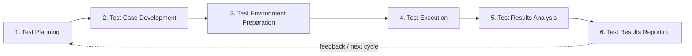

# BGSTM — Better Global Software Testing Methodology

!!! info "A practical six-phase testing methodology"
    BGSTM gives teams a stable, methodology-agnostic quality lifecycle that works across Agile, Scrum, Waterfall, and hybrid delivery models.

-   :material-book-open-page-variant:{ .lg .middle } __Learn BGSTM__

    ---

    Understand the canonical six-phase testing lifecycle and how the pieces fit together.

    [:octicons-arrow-right-24: Explore the Six Phases](phases/index.md)

-   :material-rocket-launch:{ .lg .middle } __Adopt BGSTM__

    ---

    Start with the smallest credible evidence chain and expand only as your project needs more rigor.

    [:octicons-arrow-right-24: Minimum Viable Adoption](minimum-viable-adoption.md)

-   :material-flask-outline:{ .lg .middle } __See It Applied__

    ---

    Follow one realistic testing initiative through all six phases from planning to reporting.

    [:octicons-arrow-right-24: Six-Phase Worked Example](examples/six-phase-checkout-worked-example.md)

-   :material-tools:{ .lg .middle } __Use the Toolkit__

    ---

    Adapt practical templates, methodology guidance, and examples to your own delivery environment.

    [:octicons-arrow-right-24: Browse Templates](test-templates/index.md)

---

## What is BGSTM?

BGSTM is a **software testing methodology and knowledge base** for organizing quality work from planning through results reporting. It is intentionally independent from any single software-development methodology, automation framework, or toolchain.

The goal is straightforward: make testing work easier to structure, trace, explain, and improve without forcing teams into unnecessary process overhead.

> **Canonical methodology:** BGSTM contains exactly **six core testing phases**. Specialized domains apply those six phases; they do not add methodology phases.

---

## The Six BGSTM Testing Phases

1. **[Test Planning](phases/01-test-planning.md)** — Define scope, strategy, risks, resources, and timelines.
2. **[Test Case Development](phases/02-test-case-development.md)** — Design traceable scenarios and test cases.
3. **[Test Environment Preparation](phases/03-test-environment-preparation.md)** — Prepare infrastructure, tools, access, and test data.
4. **[Test Execution](phases/04-test-execution.md)** — Execute tests, collect evidence, and manage defects.
5. **[Test Results Analysis](phases/05-test-results-analysis.md)** — Interpret outcomes, trends, risks, and quality signals.
6. **[Test Results Reporting](phases/06-test-results-reporting.md)** — Communicate findings and support release decisions.

---

## Why BGSTM?

-   :material-swap-horizontal:{ .lg .middle } __Methodology Agnostic__

    ---

    Apply the same testing lifecycle across Agile, Scrum, Waterfall, and hybrid delivery.

-   :material-link-variant:{ .lg .middle } __Traceable__

    ---

    Connect requirements, tests, results, defects, evidence, and decisions into a meaningful chain.

-   :material-alert-decagram:{ .lg .middle } __Risk Aware__

    ---

    Scale testing depth and rigor according to business and technical risk.

-   :material-chart-line:{ .lg .middle } __Evidence Based__

    ---

    Turn execution results and quality signals into clear stakeholder decisions.

-   :material-progress-check:{ .lg .middle } __Practical to Adopt__

    ---

    Start small, then add templates, automation, dashboards, and integrations as they become useful.

-   :material-puzzle-outline:{ .lg .middle } __Tool Independent__

    ---

    Use BGSTM with the tools you already have; the reference application is optional.

---

## Adapt BGSTM to Your Delivery Model

BGSTM's six phases remain stable while the pacing, ceremony, and implementation details adapt to the surrounding delivery model.

- **[Agile Testing](methodologies/agile.md)** — Continuous testing and rapid feedback.
- **[Scrum Testing](methodologies/scrum.md)** — Sprint-based application of the lifecycle.
- **[Waterfall Testing](methodologies/waterfall.md)** — Sequential delivery and phase-gate contexts.
- **[Methodology Comparison](methodologies/comparison.md)** — Compare adaptation approaches side by side.

---

## Practical Examples and Templates

Use the methodology with concrete artifacts rather than treating it as abstract process guidance.

- **[Six-Phase Checkout Worked Example](examples/six-phase-checkout-worked-example.md)** — A complete end-to-end example covering all six phases.
- **[Test Templates](test-templates/index.md)** — Reusable plans, cases, risk assessments, traceability matrices, defect reports, and summary reports.
- **[ETL Semantic Validation Applied Example](examples/etl-semantic-validation-example.md)** — A specialized application of the same six-phase methodology using NATAegisFlow evidence.

ETL semantic validation is an application of BGSTM, **not** an additional methodology phase.

---

## Optional Reference Application

BGSTM is first and foremost a **testing methodology and knowledge base**. This repository also contains an open-source FastAPI and React reference application demonstrating traceability, dashboards, reporting, notifications, external-result ingestion, and related testing-management workflows.

The application supports and demonstrates the methodology; it does **not** define BGSTM or add methodology phases.

[:octicons-arrow-right-24: Reference Application Documentation](application/index.md)

---

## Continue Exploring

-   :material-clock-fast:{ .lg .middle } __New to BGSTM?__

    ---

    Follow the practical introductory path before diving into individual artifacts.

    [:octicons-arrow-right-24: Getting Started](GETTING-STARTED.md)

-   :material-file-document-multiple:{ .lg .middle } __Need an Artifact?__

    ---

    Jump directly to the canonical templates library.

    [:octicons-arrow-right-24: Templates](test-templates/index.md)

-   :material-github:{ .lg .middle } __Want the Source?__

    ---

    Review the repository, implementation, release history, and contribution workflow on GitHub.

    [:octicons-arrow-right-24: View on GitHub](https://github.com/bg-playground/BGSTM)

-   :material-bug:{ .lg .middle } __Found a Problem or Have an Idea?__

    ---

    Use the public issue tracker for defects, questions, and documentation improvements.

    [:octicons-arrow-right-24: Open an Issue](https://github.com/bg-playground/BGSTM/issues)

---

## Contributing and License

Contributions are welcome for methodology guidance, documentation, examples, templates, application code, and integrations. See the **[Contributing Guide](CONTRIBUTING.md)** before opening a pull request.

BGSTM is licensed under the **MIT License**. See the [license](LICENSE.md) for details.
