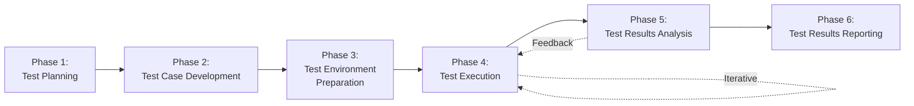

# Testing Phases

BGSTM defines six core phases that structure the software testing process from initial planning through final reporting. Each phase builds upon the previous one, creating a comprehensive testing workflow.

## The Six Phases

### [Phase 1: Test Planning](01-test-planning.md)
**Define scope, strategy, resources, and timelines**

The foundational phase where the testing strategy, scope, objectives, and resources are defined. This phase sets the direction for all subsequent testing activities.

**Key Activities:** Test scope definition, resource planning, risk assessment, schedule creation

---

### [Phase 2: Test Case Development](02-test-case-development.md)
**Design and document test scenarios and cases**

Design and document detailed test scenarios, test cases, and test scripts that will validate the software application.

**Key Activities:** Requirements analysis, test design, test case documentation, traceability mapping

---

### [Phase 3: Test Environment Preparation](03-test-environment-preparation.md)
**Set up infrastructure and tools**

Set up the hardware, software, network, and infrastructure components required to execute test cases in production-like conditions.

**Key Activities:** Environment setup, tool configuration, test data preparation, validation

---

### [Phase 4: Test Execution](04-test-execution.md)
**Execute tests and manage defects**

Execute test cases, identify and log defects, compare actual results against expected results, and manage the defect lifecycle.

**Key Activities:** Test execution, defect logging, retesting, regression testing, progress tracking

---

### [Phase 5: Test Results Analysis](05-test-results-analysis.md)
**Analyze outcomes and identify patterns**

Examine test execution outcomes, analyze defect trends, evaluate test coverage, and derive insights to improve software quality.

**Key Activities:** Metrics collection, defect analysis, coverage analysis, quality assessment

---

### [Phase 6: Test Results Reporting](06-test-results-reporting.md)
**Communicate findings to stakeholders**

Communicate test findings, analysis, and recommendations to stakeholders through comprehensive reports and presentations.

**Key Activities:** Report generation, stakeholder communication, sign-off, lessons learned

---

## Phase Workflow

## Methodology Adaptations

Each phase can be adapted to your specific methodology:

- **Agile/Scrum:** Phases occur within each sprint/iteration
- **Waterfall:** Phases occur sequentially at defined project stages
- **Hybrid:** Mix and match based on project needs

[:octicons-arrow-right-24: Learn more about methodologies](../methodologies/index.md)
